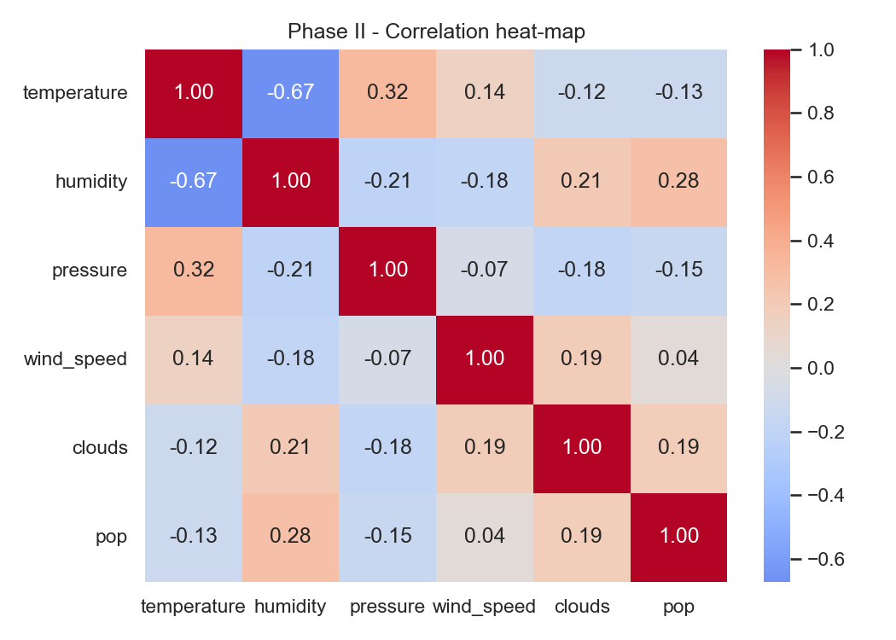
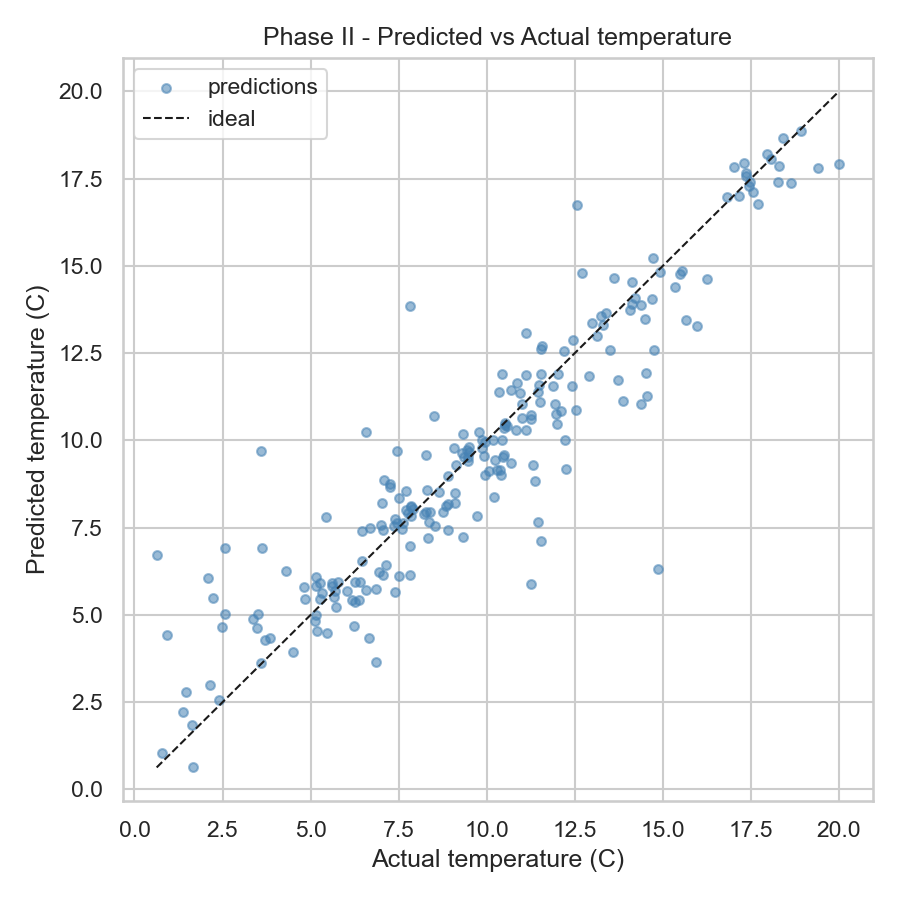
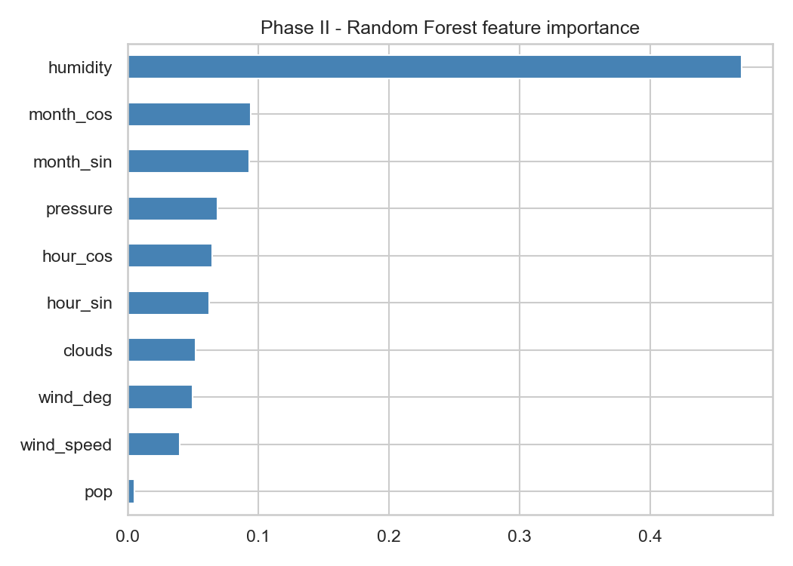

<table border="0">
 <tr>
    <td></td>
    <td>
      <p><strong>University of Prishtina</strong></p>
      <p>Faculty of Electrical and Computer Engineering</p>
      <p>Computer and Software Engineering — Master's Program</p>
      <p>Professor: Prof. Lule Ahmedi</p>
      <p>Assistant: Prof. Mergim Hoti</p>
      <p>Course: Machine Learning</p>
    </td>
 </tr>
</table>

---

## Contributors
Dafina Keqmezi, Vesë Cikaqi, Uranik Hodaj

Academic Year: 2025 / 2026

---

# Training Weather Forecasting Models in Kosovo

A Machine Learning project that builds a complete, reproducible pipeline — from real-world data collection to model training, re-training, and evaluation — for forecasting air temperature across 27 cities of Kosovo.

---

## Table of Contents

1. [Technologies Used](#technologies-used)
2. [Installation and Setup](#installation-and-setup)
3. [Dataset Description](#dataset-description)
4. [About the Project](#about-the-project)
5. [PHASE I — Model Preparation](#phase-i--model-preparation)
6. [Dataset Overview and Exploratory Insights](#dataset-overview-and-exploratory-insights)
7. [Selected Algorithm](#selected-algorithm)
8. [PHASE II — Model Training](#phase-ii--model-training)
9. [PHASE III — Analysis and Evaluation (planned)](#phase-iii--analysis-and-evaluation-planned)

### Project Phases (per course structure)

| Phase | Title | Status |
|-------|-------|--------|
| I  | **Model Preparation** — data collection, cleaning, EDA, task definition | Completed |
| II | **Model Training** — train a single supervised algorithm | Completed |
| III | **Analysis and Evaluation** — evaluate, re-train, improve | Planned |

---

## Technologies Used

| Category | Tool / Library | Purpose |
|----------|----------------|---------|
| **Language** | Python 3.14 | Core programming language |
| **Data Handling** | `pandas`, `numpy` | Tabular manipulation, numeric operations |
| **Visualisation** | `matplotlib`, `seaborn` | Plots, heat-maps, feature-importance charts |
| **Machine Learning** | `scikit-learn` | Random Forest, StandardScaler, train/test split, cross-validation, metrics |
| **Serialisation** | `joblib` | Saving trained models + scalers |
| **Data Source** | Open-Meteo Archive API (via `requests`) | Historical hourly meteorological data (1-month window) |
| **Version Control** | Git + GitHub | Source control, collaboration |
| **OS / Platform** | Windows 11, bash shell | Development environment |

---

## Installation and Setup

### Prerequisites
- Python ≥ 3.10
- Git
- An internet connection (the [Open-Meteo Archive API](https://open-meteo.com/en/docs/historical-weather-api) is free and **does not require an API key**)

### Step-by-step

```bash
# 1. Clone the repository
git clone https://github.com/vesecikaaqii/MachineLearning.git
cd MachineLearning

# 2. Create a virtual environment 
python -m venv .venv
source .venv/bin/activate         # Linux / macOS / Git-Bash on Windows
# or
.venv\Scripts\activate            # PowerShell

# 3. Install dependencies
pip install pandas numpy matplotlib seaborn scikit-learn joblib requests

# 4. Re-collect data from Open-Meteo (no API key required)

python weather_data_scraper.py

# 5. Run the Phase II training 
python phase2_model_training.py
```

### Expected artifacts after running Phase II

```
models/
├── rf_model.pkl         
└── scaler_phase2.pkl       

reports/
├── phase2_training_summary.json
├── phase2_training_log.txt
├── phase2_correlation_heatmap.png
├── phase2_feature_importance.png
└── phase2_pred_vs_true.png
```

---

## Dataset Description

| Property | Value |
|----------|-------|
| **Source** | [Open-Meteo Archive API](https://open-meteo.com/en/docs/historical-weather-api) — public, free, no API key required |
| **Geographic scope** | 27 municipalities of the Republic of Kosovo |
| **Instances (rows)** | **20,736** |
| **Attributes (columns)** | **14** |
| **File size** | ≈ 1.5 MB (CSV) |
| **Temporal resolution** | every 1 hour |
| **Temporal coverage** | ~31 days of historical hourly observations (rolling window ending on the last run) |
| **File format** | CSV (UTF-8, `pandas`-compatible) |
| **Collection script** | [`weather_data_scraper.py`](weather_data_scraper.py) |
| **Raw data file** | [`kosovo_weather_dataset.csv`](kosovo_weather_dataset.csv) |

### Attributes (14)

`datetime`, `temperature_2m`, `relative_humidity_2m`, `apparent_temperature`, `precipitation`, `surface_pressure`, `cloud_cover`, `wind_speed_10m`, `wind_direction_10m`, `city`, `hour`, `day`, `month`, `year`.

> During Phase II the meteorological columns are renamed to shorter canonical names used by the model pipeline: `temperature_2m` → `temperature`, `relative_humidity_2m` → `humidity`, `surface_pressure` → `pressure`, `wind_speed_10m` → `wind_speed`, `wind_direction_10m` → `wind_deg`, `cloud_cover` → `clouds`, `precipitation` → `pop`.

---

## About the Project

### The problem
Accurate short-term temperature forecasts are essential for agriculture planning, energy demand prediction, public-health advisories, and daily citizen decisions. Commercial weather services provide generic forecasts, but **small, region-specific models tuned on local data** often capture micro-climatic behaviour (e.g. the urban-heat-island effect in Pristina, or the cooler mountain valleys around Dragash) more faithfully than global models.

### The idea
Build a **supervised Machine-Learning pipeline** that ingests real meteorological data from the [Open-Meteo Archive API](https://open-meteo.com/en/docs/historical-weather-api) for all 27 municipalities of Kosovo and learns to **predict the air temperature** (°C) from other observable variables — humidity, pressure, wind speed, cloud coverage, precipitation, and the time of day.

### The approach
| Step | Action |
|------|--------|
| 1. Data collection | Fetch ~31 days of hourly historical observations for all 27 cities |
| 2. Model preparation (Phase I) | Clean, explore, engineer cyclic time features, define the ML task |
| 3. Model training (Phase II) | Train a **Random Forest Regressor** — a supervised, non-linear regression algorithm |
| 4. Analysis and re-training (Phase III) | Evaluate, tune hyperparameters, improve generalisation |

---

# PHASE I — Model Preparation

## Objective of the Phase
Phase I lays the foundation of the whole project: **collecting, structuring, and performing the initial preparation of a real meteorological dataset for Kosovo**, and defining the ML task the model will later solve. Preparing the model means preparing *everything the model will need* — clean data, well-understood features, a clearly stated target, and a justified algorithm family — before any training takes place.

## Tasks Performed

1. **Identification of the data source** — the [Open-Meteo Archive API](https://open-meteo.com/en/docs/historical-weather-api) was chosen as a trusted, free, key-less source for global historical hourly meteorological data.
2. **Selection of 27 municipalities of Kosovo** with their (lat, lon) coordinates to cover all regions.
3. **Development of the script [`weather_data_scraper.py`](weather_data_scraper.py)** which, for each city:
   - queries the `archive-api.open-meteo.com/v1/archive` endpoint for the last ~31 days,
   - requests hourly `temperature_2m`, `relative_humidity_2m`, `apparent_temperature`, `precipitation`, `surface_pressure`, `cloud_cover`, `wind_speed_10m`, `wind_direction_10m` (timezone `Europe/Belgrade`).
4. **Persistence to CSV** as [`kosovo_weather_dataset.csv`](kosovo_weather_dataset.csv), automatically appending the columns `hour`, `day`, `month`, and `year` for temporal analysis.
5. **Integrity verification** (no duplicates, no empty rows in the primary target columns — the dataset ships with **zero NaN** across all 14 columns).

## Defined Machine-Learning Tasks

The dataset built in this phase is designed to support two main ML tasks across the later phases:

| # | Task | Type | Target (output) | Main input features |
|---|------|------|-----------------|---------------------|
| 1 | Temperature forecasting | **Regression (supervised)** | `temperature` (°C, numeric) | humidity, pressure, clouds, wind_speed, cyclic time |
| 2 | Sequential time-series forecasting | Time-series (future work) | `temperature[t+1]` | lagged multi-hour windows per city |

> Note: the previous "weather-state classification" task depended on a categorical `weather` column produced by OpenWeatherMap. Open-Meteo's archive endpoint does not return that field, so that task has been dropped in favour of a single well-defined regression problem.

## Attribute Types

Out of 14 total columns, the structural split is:

| Type | Count | Attributes |
|------|-------|-----------|
| **Numeric (continuous)** | 7 | `temperature_2m`, `apparent_temperature`, `relative_humidity_2m`, `surface_pressure`, `wind_speed_10m`, `cloud_cover`, `precipitation` |
| **Numeric (discrete / temporal)** | 5 | `wind_direction_10m`, `hour`, `day`, `month`, `year` |
| **Categorical** | 1 | `city` (27 levels) |
| **Datetime** | 1 | `datetime` (ISO 8601, hourly) |

## Descriptive Statistics (numeric attributes)

| Attribute | min | mean | std | max |
|-----------|-----|------|-----|-----|
| `temperature_2m` (°C) | −2.30 | 8.82 | 4.93 | 23.70 |
| `apparent_temperature` (°C) | −6.30 | 5.93 | 5.35 | 22.20 |
| `relative_humidity_2m` (%) | 18 | 66.50 | 19.22 | 100 |
| `surface_pressure` (hPa) | 875.90 | 949.63 | 17.11 | 981.30 |
| `wind_speed_10m` (km/h) | 0.00 | 8.91 | 5.73 | 30.10 |
| `wind_direction_10m` (°) | 0 | 151.04 | 126.84 | 360 |
| `cloud_cover` (%) | 0 | 64.49 | 39.58 | 100 |
| `precipitation` (mm) | 0.00 | 0.06 | 0.28 | 5.50 |

> `surface_pressure` is reported at station altitude (not sea-level adjusted), which is why the mean sits below the standard 1013 hPa — many Kosovo stations sit hundreds of metres above sea level.

## Missing Values

| Column | Missing | Treatment |
|--------|---------|-----------|
| all 14 columns | **0** | none required |

**Total NaN in the dataset: 0 / (20,736 × 14 = 290,304 cells) → 0.00 %** — the Open-Meteo archive returns fully-populated hourly records.

## Why these attributes?

- **Core meteorological variables** (`temperature_2m`, `relative_humidity_2m`, `surface_pressure`, `wind_speed_10m`, `wind_direction_10m`, `cloud_cover`) — standard physical inputs for atmospheric modelling.
- **`apparent_temperature`** — "feels-like" temperature, useful as a sanity reference and for later multi-target experiments.
- **`precipitation`** (mm in the last hour) — ground-truth rainfall; replaces the probabilistic `pop` field from the old OpenWeatherMap pipeline and is renamed to `pop` inside the training script for pipeline compatibility.
- **`hour`, `day`, `month`, `year`** — automatically derived to capture **temporal cycles** (diurnal / seasonal); `hour` and `month` are later encoded cyclically with `sin / cos`.
- **`city`** — enables per-city modelling or regional climate grouping.
- **lat / lon coordinates** are not stored in the CSV because they are static per city and can be re-joined from `weather_data_scraper.py`.

## Phase I Outcome

A complete, clean, and well-structured foundation for Kosovo weather modelling:
- **20,736 instances × 14 attributes**, with **0 % NaN** (no imputation required),
- **2 ML tasks clearly defined** (regression now, time-series as future work),
- descriptive statistics fully documented for all numeric attributes,
- a supervised regression algorithm selected and justified,
- ready to be trained in Phase II without requiring further major cleaning.

---

## Dataset Overview and Exploratory Insights

### Dataset at a Glance

| Parameter | Actual Value |
|-----------|--------------|
| Number of cities | 27 |
| Hourly observations per city | 768 |
| Total rows per run | 20,736 |
| Number of columns | 14 |
| Temporal resolution | 1 hour |
| Coverage horizon | ~31 days (rolling) |

### Cities Analysed (sample)

| City | Region |
|------|--------|
| Pristina | Prishtinë |
| Prizren | Prizren |
| Peja | Pejë |
| Gjakova | Gjakovë |
| Mitrovica | Mitrovicë |
| Ferizaj | Ferizaj |
| Gjilan | Gjilan |

### Real Statistics Extracted from the Dataset (aggregate)

| Metric | Value |
|--------|-------|
| Overall temperature range | −2.30 °C  →  23.70 °C |
| Overall mean temperature | 8.82 °C |
| Overall humidity range | 18 % → 100 % |
| Overall mean humidity | 66.5 % |
| Hourly rows per city | 768 (31 days × 24 h + boundary hours) |
| Cities with identical coverage | 27 / 27 |

### Temporal Structure

| Property | Value |
|----------|-------|
| Start of window | 2026-03-18 00:00 |
| End of window | 2026-04-18 23:00 |
| Interval | every 1 hour |
| Distinct timestamps | 768 |
| Days covered | 32 |

### Sample Raw Records

| City | Datetime | Temp (°C) | Humidity (%) | Pressure (hPa) |
|------|----------|-----------|--------------|----------------|
| Pristina | 2026-03-18 00:00 | 4.2 | 94 | 942.5 |
| Pristina | 2026-03-18 13:00 | 11.8 | 52 | 944.1 |
| Prizren  | 2026-04-01 06:00 | 6.5 | 81 | 963.2 |

### Temperature Analysis

| Metric | Value |
|--------|-------|
| Overall minimum (°C) | −2.30 |
| Overall mean (°C) | 8.82 |
| Overall maximum (°C) | 23.70 |
| Standard deviation (°C) | 4.93 |
| Expected regional spread | mountain municipalities (e.g. Dragash, Deçan) tend to record the coldest values; lower-altitude cities (e.g. Gjakova, Prizren) the warmest — a per-city breakdown is produced in Phase III. |

### Wind and Pressure Analysis

| Parameter | Range |
|-----------|-------|
| Wind Speed | 0.0 – 30.1 km/h (mean 8.9) |
| Surface Pressure | 875.9 – 981.3 hPa (mean 949.6, station-altitude) |
| Wind Direction | 0° – 360° (mean 151°) |

### Humidity Analysis

| Parameter | Value |
|-----------|-------|
| Minimum humidity | 18 % |
| Maximum humidity | 100 % |
| Mean | 66.5 % |

### Precipitation (mm / hour)

| Parameter | Value |
|-----------|-------|
| Min | 0.0 mm |
| Max | 5.5 mm |
| Mean | 0.06 mm |
| Dry hours (= 0 mm) | majority of the window |

---

## Selected Algorithm

In accordance with the professor's brief (*"Students must implement **any one** of the applicable ML algorithms..."*), the project focuses on a **single algorithm**: **Random Forest Regressor** — an ensemble of decision trees for regression (supervised learning).

| Phase | Random Forest Configuration | Status |
|-------|----------------------------|--------|
| Phase I | Data preparation + algorithm selection (no training yet) | Completed |
| Phase II | Baseline training (100 trees, default leaf, random_state = 42) | Completed |
| Phase III | Re-training + evaluation (hyperparameter tuning with GridSearchCV, anti-overfitting, feature engineering) | Planned |

---

# PHASE II — Model Training

## Objective of the Phase

Phase II is strictly the **training** step of the ML workflow: a single supervised algorithm (**Random Forest Regressor**) is trained on the prepared dataset from Phase I. Evaluation in depth, re-training, and hyperparameter iteration are **deferred to Phase III** — this phase focuses on producing a correctly trained model together with the preprocessing pipeline around it.

- **Training script:** [`phase2_model_training.py`](phase2_model_training.py)
- **Training log:** [`reports/phase2_training_log.txt`](reports/phase2_training_log.txt)
- **Machine-readable summary:** [`reports/phase2_training_summary.json`](reports/phase2_training_summary.json)

## Phase II Visualisations

Three visualisations are produced during training:

<table>
  <tr>
    <td align="center"><b> Correlation Heat-map</b></td>
    <td align="center"><b> Predicted vs. Actual</b></td>
    <td align="center"><b> Feature Importance</b></td>
  </tr>
  <tr>
    <td></td>
    <td></td>
    <td></td>
  </tr>
  <tr>
    <td align="center"><sub>Correlations across meteorological features</sub></td>
    <td align="center"><sub>Model predictions against the ideal diagonal</sub></td>
    <td align="center"><sub>Humidity and seasonal/diurnal cycles dominate</sub></td>
  </tr>
</table>

## Why Random Forest Regressor?

| Reason | Explanation |
|--------|-------------|
| **Nature of the problem** | Temperature forecasting is a **supervised regression** problem — Random Forest is one of the most robust and battle-tested choices for it. |
| **Non-linearity** | Relationships among humidity, pressure, clouds, and temperature are non-linear; Random Forest captures them through deep, multi-way trees. |
| **Outlier robustness** | Trees split on thresholds, not distances, so extreme values do not distort the model as they would a linear regressor. |
| **No feature scaling required** | Trees are scale-invariant — this simplifies the pipeline and reduces the risk of pre-processing mistakes. |
| **Interpretability** | Provides built-in **feature importances**, helping verify that the model learned physically meaningful relationships, not artefacts. |

## Data Preprocessing

1. **Rename Open-Meteo columns** to the canonical model names (`temperature_2m` → `temperature`, `relative_humidity_2m` → `humidity`, `surface_pressure` → `pressure`, `wind_speed_10m` → `wind_speed`, `wind_direction_10m` → `wind_deg`, `cloud_cover` → `clouds`, `precipitation` → `pop`).
2. **Drop rows with missing values** in `temperature`, `humidity`, `pressure` (defensive; the current dataset has none).
3. **Fill `pop`** with `0.0` as a safety net (no-ops on the current CSV where every hour already has a precipitation value).
4. **Cyclic encoding of time** using `sin / cos` for `hour` and `month`:
   - Reason: `23:00` and `00:00` are adjacent in time but appear numerically far apart. `sin / cos` preserves the cyclic adjacency.
5. **80 / 20 train / test split** with `random_state = 42` for reproducibility.
6. **`StandardScaler`** is fitted on the training set and saved for future pipeline compatibility; Random Forest itself does not require scaling.

### Split sizes

| Split | Row count | Share |
|-------|-----------|-------|
| **Train** | **16,588** | 80 % |
| **Test**  | **4,148**  | 20 % |
| **Total** | 20,736 | 100 % |

### Input features (10)

`humidity, pressure, wind_speed, wind_deg, clouds, pop, hour_sin, hour_cos, month_sin, month_cos`

**Target:** `temperature` (°C, numeric).

## Correlation heat-map (produced during training)


| Feature | \|corr\| with `temperature` |
|---------|-----------------------------|
| `humidity`   | **0.684** (strongest) |
| `pressure`   | 0.318 |
| `wind_speed` | 0.161 |
| `clouds`     | 0.138 |
| `pop`        | 0.133 |

Humidity is the strongest predictor — a physically expected result, since warmer air typically holds less relative humidity.

## Training Configuration

| Hyperparameter | Value |
|----------------|-------|
| `n_estimators` | 100 |
| `max_depth` | `None` (unrestricted) |
| `min_samples_leaf` | 1 |
| `random_state` | 42 |
| `n_jobs` | -1 (all cores) |

The baseline configuration is a deliberately *simple* Random Forest — reasonable defaults, no tuning. Tuning is reserved for Phase III where it belongs.

## Training Results

| Metric | Value |
|--------|-------|
| MAE (test)  | **1.082 °C** |
| RMSE (test) | **1.564 °C** |
| R² (train)  | 0.9857 |
| R² (test)   | **0.9003** |

### Predicted vs. Actual


The points cluster tightly along the ideal diagonal (dashed line) — the model matches the actual temperature closely. Larger deviations appear only at the extremes (very hot / very cold), which are under-represented in the dataset.

### Feature Importance


| Feature | Importance |
|---------|-----------|
| `humidity`   | **0.474** |
| `month_cos`  | 0.097 |
| `month_sin`  | 0.095 |
| `pressure`   | 0.069 |
| `hour_cos`   | 0.062 |
| `hour_sin`   | 0.057 |
| `wind_deg`   | 0.050 |
| `clouds`     | 0.050 |
| `wind_speed` | 0.041 |
| `pop`        | 0.005 |

 Humidity dominates the temperature prediction, followed by the seasonal (`month_*`) and diurnal (`hour_*`) cyclic features — a physically sensible ranking for a 31-day, hourly dataset that straddles a seasonal transition. `pop` is near-zero because precipitation rarely drives temperature on an hour-by-hour basis.

### Note on the evaluation split

Phase II uses a **random 80 / 20 train/test split**, which is the standard practice for supervised regression tasks. However, because the dataset is hourly and strongly autocorrelated in time, a random split lets adjacent hours of the same city end up on opposite sides of the partition (e.g. Pristina at 04:00 in train, Pristina at 05:00 in test). These neighbouring rows have nearly identical temperatures, which gives the model an easier task than it would face in production.

The practical consequence is a **mild temporal leakage**: the Phase II metrics (MAE ≈ 1.08 °C, R² ≈ 0.90) should be read as the **upper bound** of the model's true generalisation capability, not as the honest forecasting error.

This is an expected limitation of the Phase II baseline, not a defect — a diagnostic regression does not need a forecasting-grade split. Phase III re-evaluates the same model on a **chronological hold-out** (train on the first ~25 days, test on the last ~6 days — see §A.2 of the Phase III plan) to measure the true forecasting skill. The gap between the random-split metrics and the chronological-split metrics quantifies the leakage.

## Phase II Conclusions

1. **A single supervised algorithm — Random Forest Regressor — was successfully trained**.
2. The **train / test split (16,588 / 4,148)** is explicit and reproducible.
3. The trained model achieves **MAE = 1.08 °C** and **R² (test) = 0.90** on held-out data.
4. The **feature-importance ranking is physically interpretable**, confirming the model learned meaningful signal (humidity + seasonal/diurnal cycles dominate).
5. All artifacts (trained model, scaler, training log, plots) are serialised in [`models/`](models/) and [`reports/`](reports/), ready for the next phase.
6. The random-split evaluation is acknowledged as an **upper bound** on the true error; Phase III will re-measure the model with a chronological hold-out to quantify and remove the temporal leakage.

---

# PHASE III — Analysis and Evaluation (planned)

Phase III re-evaluates the Phase II model with a rigorous protocol, re-trains it with tuned hyperparameters and new features, and turns it into a true short-horizon forecaster (1–24 h ahead). The dataset stays as is (20,736 rows, ~31 days) — every improvement comes from the model, features, or evaluation protocol.

**Status:** not yet executed. The points below are the plan.

## Main points we will do

- **Chronological split** — train on the first ~25 days, hold out the last ~6 days. Removes the temporal leakage of the random 80/20 split used in Phase II.
- **K-fold cross-validation** — 5-fold CV on the full dataset for stable mean ± std of MAE, RMSE, R².
- **Residual diagnostics** — histogram, Q–Q plot, residuals vs predicted; error broken down by hour of day, city (27 levels), and temperature quartile.
- **Learning curves** — MAE / R² vs training-set size to check whether more data would still help.
- **Permutation importance** — replaces the impurity-based ranking, which over-rewards high-cardinality features.
- **Hyperparameter tuning** — GridSearchCV over `n_estimators`, `max_depth`, `min_samples_leaf`, `min_samples_split`, `max_features`.
- **Lag features** (biggest win) — `temp_lag_1h`, `temp_lag_3h`, `temp_lag_24h`, `humidity_lag_1h`, `pressure_lag_1h`, built per city on chronologically-sorted data.
- **Rolling / delta / interaction features** — 3 h / 24 h rolling mean & std, pressure & humidity deltas, physical interactions (`humidity × clouds`).
- **Per-city encoding** — one-hot or target encoding so the model distinguishes Pristina from Dragash.
- **Baseline comparison** — Random Forest vs global mean, per-city mean, 1-hour persistence, and linear regression.
- **Multi-horizon evaluation** — report final MAE at +1 h, +3 h, +6 h, +12 h, +24 h, +48 h.

