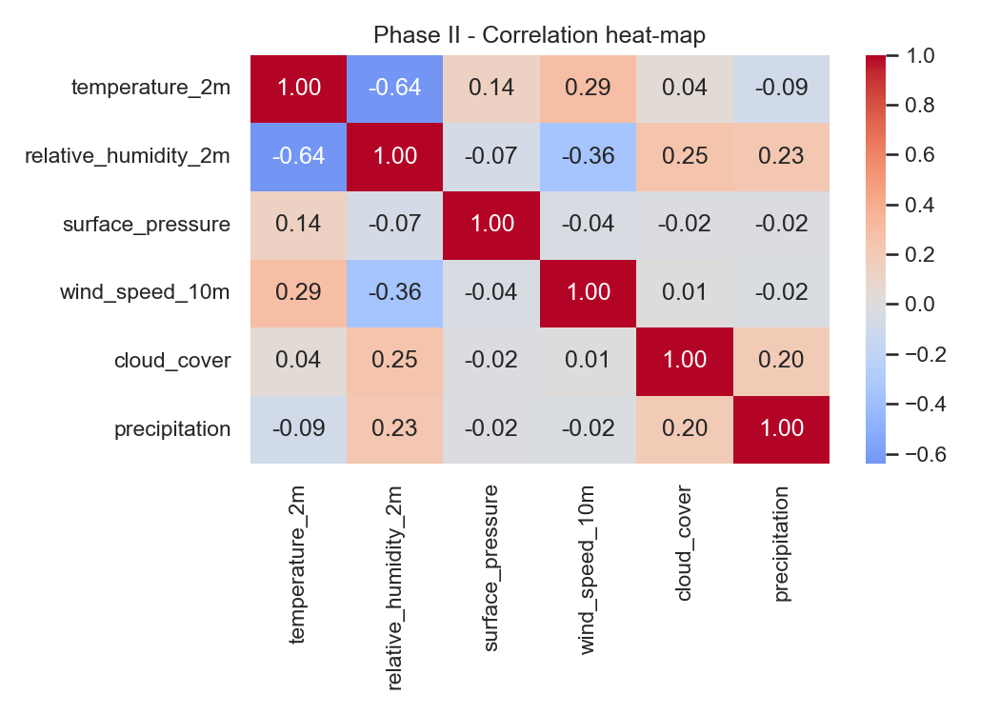
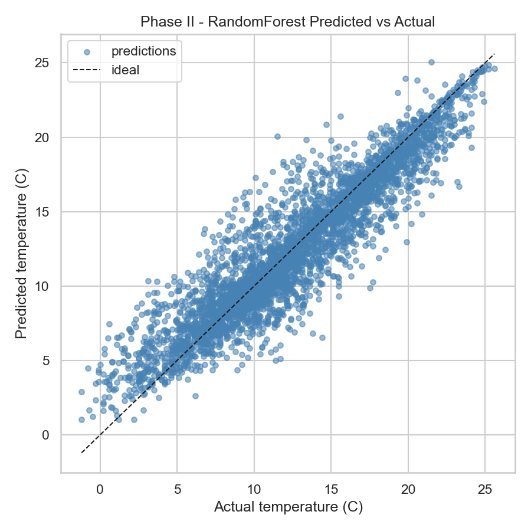
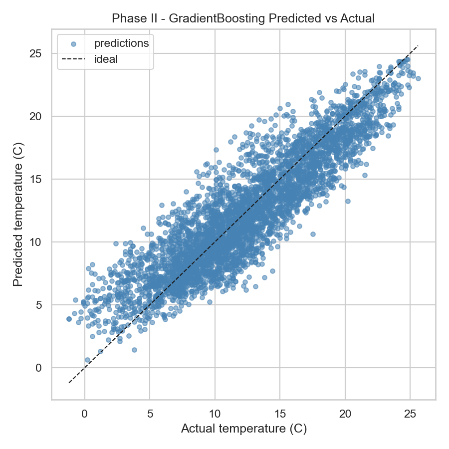
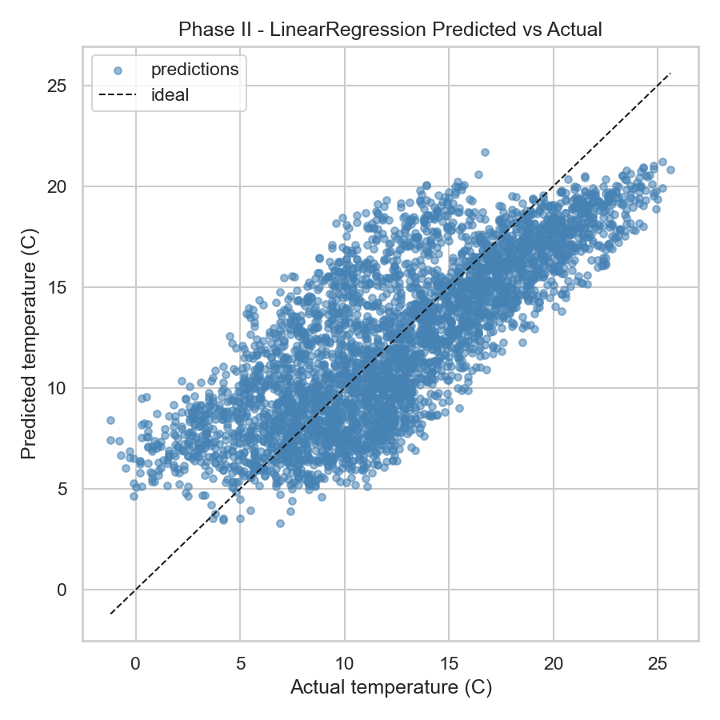
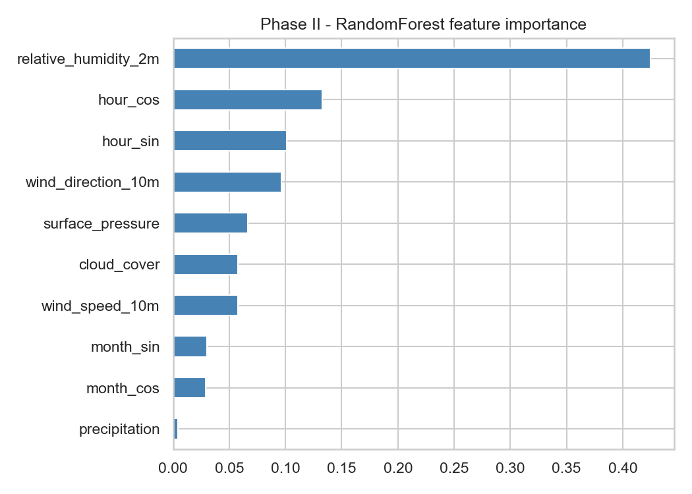
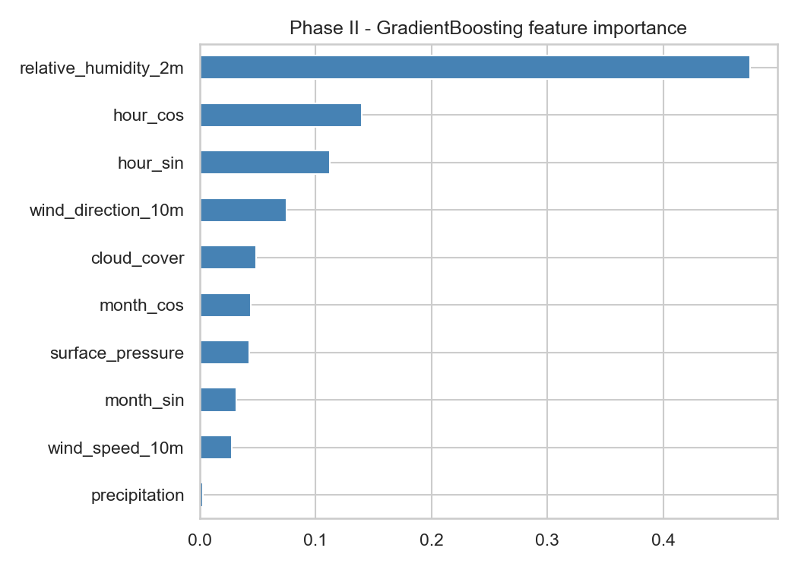
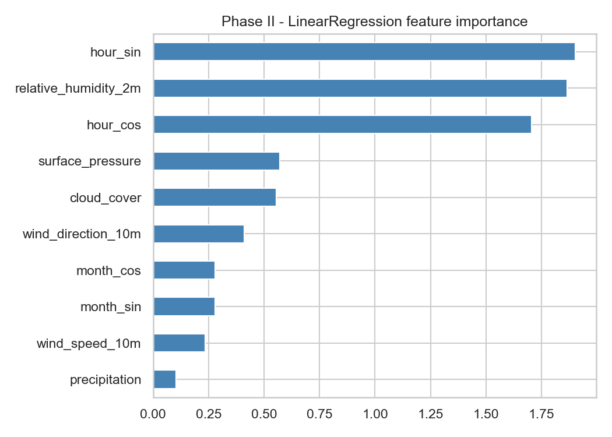
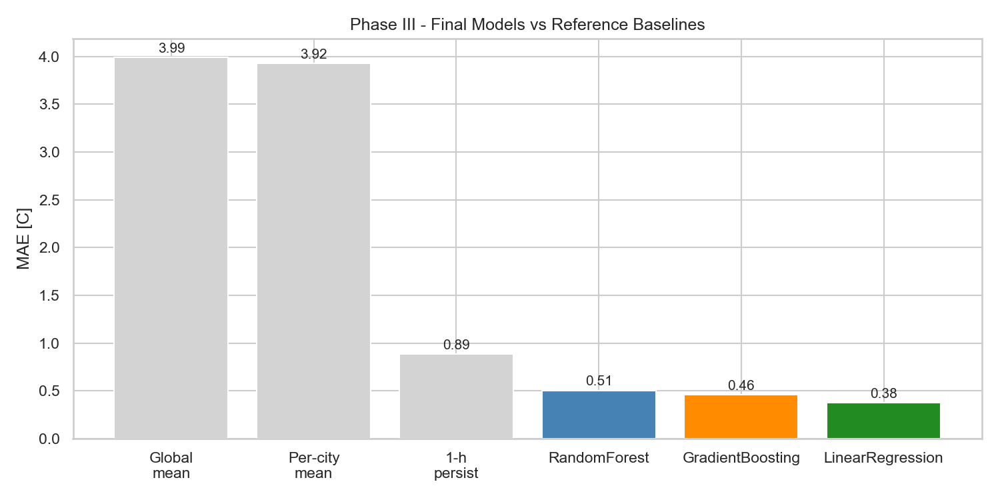

<table border="0">
 <tr>
    <td></td>
    <td>
      <p><strong>University of Prishtina</strong></p>
      <p>Faculty of Electrical and Computer Engineering</p>
      <p>Computer and Software Engineering — Master's Program</p>
      <p>Professor: Prof. Lule Ahmedi</p>
      <p>Assistant: Prof. Mergim Hoti</p>
      <p>Course: Machine Learning</p>
    </td>
 </tr>
</table>

---

## Contributors
Dafina Keqmezi, Vesë Cikaqi, Uranik Hodaj

Academic Year: 2025 / 2026

---

# Training Weather Forecasting Models in Kosovo

A Machine Learning project that builds a complete, reproducible pipeline — from real-world data collection to training, **comparison of three supervised algorithms** (Random Forest, Gradient Boosting, Linear Regression), re-training, and evaluation — for forecasting air temperature across 27 cities of Kosovo.

---

### Project Phases (per course structure)

| Phase | Title | Status |
|-------|-------|--------|
| I  | **Model Preparation** — data collection, cleaning, task definition | Completed |
| II | **Model Training** — train and compare three supervised algorithms (RF, GB, LR) | Completed |
| III | **Analysis and Evaluation** — evaluate every algorithm rigorously, re-train, improve | Completed |

---

## Technologies Used

| Category | Tool / Library | Purpose |
|----------|----------------|---------|
| **Language** | Python 3.14 | Core programming language |
| **Data Handling** | `pandas`, `numpy` | Tabular manipulation, numeric operations |
| **Visualisation** | `matplotlib`, `seaborn` | Plots, heat-maps, feature-importance charts |
| **Machine Learning** | `scikit-learn` | RandomForestRegressor, GradientBoostingRegressor, LinearRegression, StandardScaler, train/test split, cross-validation, GridSearchCV, metrics |
| **Serialisation** | `joblib` | Saving trained models + scalers |
| **Data Source** | Open-Meteo Archive API (via `requests`) | Historical hourly meteorological data (1-month window) |
| **Version Control** | Git + GitHub | Source control, collaboration |
| **OS / Platform** | Windows 11, bash shell | Development environment |

---

## Installation and Setup

### Prerequisites
- Python ≥ 3.10
- Git
- An internet connection (the [Open-Meteo Archive API](https://open-meteo.com/en/docs/historical-weather-api) is free and **does not require an API key**)

### Step-by-step

```bash
# 1. Clone the repository
git clone https://github.com/vesecikaaqii/MachineLearning.git
cd MachineLearning

# 2. Create a virtual environment 
python -m venv .venv
source .venv/bin/activate         # Linux / macOS / Git-Bash on Windows
# or
.venv\Scripts\activate            # PowerShell

pip install pandas numpy matplotlib seaborn scikit-learn joblib requests


python weather_data_scraper.py

python phase2_model_training.py

python phase3_evaluation.py

python phase3_retraining.py
```


## Dataset Description

| Property | Value |
|----------|-------|
| **Source** | [Open-Meteo Archive API](https://open-meteo.com/en/docs/historical-weather-api) — public, free, no API key required |
| **Geographic scope** | 27 municipalities of the Republic of Kosovo |
| **Instances (rows)** | **20,736** |
| **Attributes (columns)** | **14** |
| **File size** | ≈ 1.5 MB (CSV) |
| **Temporal resolution** | every 1 hour |
| **Temporal coverage** | ~31 days of historical hourly observations (rolling window ending on the last run) |
| **File format** | CSV (UTF-8, `pandas`-compatible) |
| **Collection script** | [`weather_data_scraper.py`](weather_data_scraper.py) |
| **Raw data file** | [`kosovo_weather_dataset.csv`](kosovo_weather_dataset.csv) |

### Attributes (14)

`datetime`, `temperature_2m`, `relative_humidity_2m`, `apparent_temperature`, `precipitation`, `surface_pressure`, `cloud_cover`, `wind_speed_10m`, `wind_direction_10m`, `city`, `hour`, `day`, `month`, `year`.

---

### The approach
| Step | Action |
|------|--------|
| 1. Data collection | Fetch ~31 days of hourly historical observations for all 27 cities |
| 2. Model preparation (Phase I) | Clean, explore, engineer cyclic time features, define the ML task |
| 3. Model training (Phase II) | Train and compare **three supervised algorithms** — Random Forest, Gradient Boosting, Linear Regression |
| 4. Analysis and re-training (Phase III) | Evaluate every algorithm rigorously (chronological split + 5-fold CV), engineer lag/rolling/interaction features, tune hyperparameters via `GridSearchCV`, pick the winner |

---

# PHASE I — Model Preparation

## Objective of the Phase
Phase I lays the foundation of the whole project: **collecting, structuring, and performing the initial preparation of a real meteorological dataset for Kosovo**, and defining the ML task the model will later solve. Preparing the model means preparing *everything the model will need* — clean data, well-understood features, a clearly stated target, and a justified algorithm family — before any training takes place.


## Defined Machine-Learning Tasks

The dataset built in this phase is designed to support two main ML tasks across the later phases:

| # | Task | Type | Target (output) | Main input features |
|---|------|------|-----------------|---------------------|
| 1 | Temperature forecasting | **Regression (supervised)** | `temperature_2m` (°C, numeric) | `relative_humidity_2m`, `surface_pressure`, `cloud_cover`, `wind_speed_10m`, cyclic time |
| 2 | Sequential time-series forecasting | Time-series (future work) | `temperature_2m[t+1]` | lagged multi-hour windows per city |

## Attribute Types

Out of 14 total columns, the structural split is:

| Type | Count | Attributes |
|------|-------|-----------|
| **Numeric (continuous)** | 7 | `temperature_2m`, `apparent_temperature`, `relative_humidity_2m`, `surface_pressure`, `wind_speed_10m`, `cloud_cover`, `precipitation` |
| **Numeric (discrete / temporal)** | 5 | `wind_direction_10m`, `hour`, `day`, `month`, `year` |
| **Categorical** | 1 | `city` (27 levels) |
| **Datetime** | 1 | `datetime` (ISO 8601, hourly) |

## Descriptive Statistics (numeric attributes)

| Attribute | min | mean | std | max |
|-----------|-----|------|-----|-----|
| `temperature_2m` (°C) | −2.30 | 8.82 | 4.93 | 23.70 |
| `apparent_temperature` (°C) | −6.30 | 5.93 | 5.35 | 22.20 |
| `relative_humidity_2m` (%) | 18 | 66.50 | 19.22 | 100 |
| `surface_pressure` (hPa) | 875.90 | 949.63 | 17.11 | 981.30 |
| `wind_speed_10m` (km/h) | 0.00 | 8.91 | 5.73 | 30.10 |
| `wind_direction_10m` (°) | 0 | 151.04 | 126.84 | 360 |
| `cloud_cover` (%) | 0 | 64.49 | 39.58 | 100 |
| `precipitation` (mm) | 0.00 | 0.06 | 0.28 | 5.50 |

## Missing Values

| Column | Missing | Treatment |
|--------|---------|-----------|
| all 14 columns | **0** | none required |


### Dataset at a Glance

| Parameter | Actual Value |
|-----------|--------------|
| Number of cities | 27 |
| Hourly observations per city | 768 |
| Total rows per run | 20,736 |
| Number of columns | 14 |
| Temporal resolution | 1 hour |
| Coverage horizon | ~31 days (rolling) |

### Cities Analysed (sample)

| City | Region |
|------|--------|
| Pristina | Prishtinë |
| Prizren | Prizren |
| Peja | Pejë |
| Gjakova | Gjakovë |
| Mitrovica | Mitrovicë |
| Ferizaj | Ferizaj |
| Gjilan | Gjilan |

### Real Statistics Extracted from the Dataset (aggregate)

| Metric | Value |
|--------|-------|
| Overall temperature range | −2.30 °C  →  23.70 °C |
| Overall mean temperature | 8.82 °C |
| Overall humidity range | 18 % → 100 % |
| Overall mean humidity | 66.5 % |
| Hourly rows per city | 768 (31 days × 24 h + boundary hours) |
| Cities with identical coverage | 27 / 27 |

### Temporal Structure

| Property | Value |
|----------|-------|
| Start of window | 2026-03-18 00:00 |
| End of window | 2026-04-18 23:00 |
| Interval | every 1 hour |
| Distinct timestamps | 768 |
| Days covered | 32 |

### Sample Raw Records

| City | Datetime | Temp (°C) | Humidity (%) | Pressure (hPa) |
|------|----------|-----------|--------------|----------------|
| Pristina | 2026-03-18 00:00 | 4.2 | 94 | 942.5 |
| Pristina | 2026-03-18 13:00 | 11.8 | 52 | 944.1 |
| Prizren  | 2026-04-01 06:00 | 6.5 | 81 | 963.2 |

### Temperature Analysis

| Metric | Value |
|--------|-------|
| Overall minimum (°C) | −2.30 |
| Overall mean (°C) | 8.82 |
| Overall maximum (°C) | 23.70 |
| Standard deviation (°C) | 4.93 |
| Expected regional spread | mountain municipalities (e.g. Dragash, Deçan) tend to record the coldest values; lower-altitude cities (e.g. Gjakova, Prizren) the warmest — a per-city breakdown is produced in Phase III. |

### Wind and Pressure Analysis

| Parameter | Range |
|-----------|-------|
| Wind Speed | 0.0 – 30.1 km/h (mean 8.9) |
| Surface Pressure | 875.9 – 981.3 hPa (mean 949.6, station-altitude) |
| Wind Direction | 0° – 360° (mean 151°) |

### Humidity Analysis

| Parameter | Value |
|-----------|-------|
| Minimum humidity | 18 % |
| Maximum humidity | 100 % |
| Mean | 66.5 % |

### Precipitation (mm / hour)

| Parameter | Value |
|-----------|-------|
| Min | 0.0 mm |
| Max | 5.5 mm |
| Mean | 0.06 mm |
| Dry hours (= 0 mm) | majority of the window |

---

## Selected Algorithms

Phase II trains three different supervised regression algorithms on the same train/test split so their behaviour can be compared head-to-head. Phase III then evaluates each algorithm rigorously and re-trains all three with engineered features and `GridSearchCV` tuning.

| Algorithm | Family | Why it is included |
|-----------|--------|--------------------|
| **Random Forest Regressor** | Ensemble of decision trees (bagging) | Robust non-linear baseline, scale-invariant, gives built-in feature importances |
| **Gradient Boosting Regressor** | Sequential boosted trees | Often the strongest tabular learner; captures complex interactions by additively correcting residuals |
| **Linear Regression** | Linear / parametric | Transparent reference model — quantifies the gain non-linear algorithms bring on top of a purely linear fit |

| Phase | Action | Status |
|-------|--------|--------|
| Phase I | Data preparation + algorithm selection (no training yet) | Completed |
| Phase II | Baseline training of all three algorithms (default-ish hyperparameters, `random_state = 42`, identical 80/20 split) | Completed |
| Phase III | Rigorous evaluation (chronological + 5-fold CV) per algorithm, then re-training of all three with lag/rolling/interaction features, city OHE, and `GridSearchCV` (TimeSeriesSplit) | Completed |

---

# PHASE II — Model Training

## Objective of the Phase

Phase II trains and compares **three supervised regression algorithms** — Random Forest, Gradient Boosting, and Linear Regression — on the same 80/20 random split, with the same feature set, the same target, and the same `random_state`. The point is not just to fit a model: it is to see how three very different learning families behave on the same Kosovo weather data.

- **Training script:** [`phase2_model_training.py`](phase2_model_training.py)
- **Training log:** [`reports/phase2_training_log.txt`](reports/phase2_training_log.txt)
- **Machine-readable summary:** [`reports/phase2_training_summary.json`](reports/phase2_training_summary.json)

## Phase II Visualisations

The training script produces, per algorithm, a *Predicted vs. Actual* scatter and a *Feature Importance* plot (impurity-based for tree models, absolute coefficients for the linear one). A single shared correlation heat-map describes the input features.

<table>
  <tr>
    <td align="center" colspan="3"><b>Correlation Heat-map (shared across all models)</b></td>
  </tr>
  <tr>
    <td colspan="3" align="center"></td>
  </tr>
  <tr>
    <td align="center"><b>Random Forest</b></td>
    <td align="center"><b>Gradient Boosting</b></td>
    <td align="center"><b>Linear Regression</b></td>
  </tr>
  <tr>
    <td></td>
    <td></td>
    <td></td>
  </tr>
  <tr>
    <td></td>
    <td></td>
    <td></td>
  </tr>
  <tr>
    <td align="center"><sub>Tightest cluster on the diagonal — best fit of the three.</sub></td>
    <td align="center"><sub>Smooth additive predictions, slightly more spread than RF.</sub></td>
    <td align="center"><sub>Visible diagonal bias — purely linear fit underfits the non-linear humidity–temperature curve.</sub></td>
  </tr>
</table>

## Why these three algorithms?

| Algorithm | Reason for inclusion |
|-----------|----------------------|
| **Random Forest Regressor** | Robust non-linear baseline. Bagging averages many deep trees, handles outliers via threshold splits, needs no feature scaling, and exposes built-in **feature importances** — useful for sanity-checking that the model latches onto physically meaningful signal. |
| **Gradient Boosting Regressor** | Sequential boosting fits each new tree on the residuals of the previous ensemble. Frequently the strongest tabular learner; captures interactions among humidity / pressure / clouds that a single tree cannot. Provides a second, independent non-linear opinion to compare against Random Forest. |
| **Linear Regression** | A transparent, parametric baseline. Forces the model to be a weighted sum of the (scaled) features. Acts as the floor: any improvement the tree-based models show *over* Linear Regression is the value contributed by non-linearity and feature interactions. Also serves as a fast sanity check. |

### Split sizes

| Split | Row count | Share |
|-------|-----------|-------|
| **Train** | **16,588** | 80 % |
| **Test**  | **4,148**  | 20 % |
| **Total** | 20,736 | 100 % |

### Input features (10)

`relative_humidity_2m, surface_pressure, wind_speed_10m, wind_direction_10m, cloud_cover, precipitation, hour_sin, hour_cos, month_sin, month_cos`

**Target:** `temperature_2m` (°C, numeric).

## Correlation heat-map (produced during training)


| Feature | \|corr\| with `temperature_2m` |
|---------|-----------------------------|
| `relative_humidity_2m`   | **0.672** (strongest) |
| `surface_pressure`       | 0.315 |
| `wind_speed_10m`         | 0.137 |
| `precipitation`          | 0.128 |
| `cloud_cover`            | 0.123 |

Humidity is the strongest predictor — a physically expected result, since warmer air typically holds less relative humidity.

## Training Configuration

All three algorithms are fit on the same scaled `X_train` (StandardScaler is mandatory for Linear Regression and harmless for the tree models). No hyperparameter tuning happens in Phase II — defaults only. Tuning is reserved for Phase III.

| Algorithm | Hyperparameters |
|-----------|-----------------|
| **Random Forest** | `n_estimators=100, max_depth=None, min_samples_leaf=1, random_state=42, n_jobs=-1` |
| **Gradient Boosting** | `n_estimators=100, learning_rate=0.1, max_depth=5, random_state=42` |
| **Linear Regression** | default OLS (`fit_intercept=True`) |

## Training Results — head-to-head

All three models are evaluated on the identical 4,148-row hold-out from the random 80/20 split.

| Model | MAE (°C) ↓ | RMSE (°C) ↓ | R² (train) | R² (test) ↑ | Train-test gap |
|-------|-----------:|------------:|-----------:|------------:|---------------:|
| **Random Forest**     | **1.383** | **1.943** | 0.9801 | **0.8609** | 0.119 |
| Gradient Boosting     | 1.799     | 2.285     | 0.8341 | 0.8076     | 0.027 |
| Linear Regression     | 2.694     | 3.256     | 0.6011 | 0.6094     | −0.008 |

**Reading of the table:**
- **Random Forest wins on raw accuracy** (lowest MAE, highest R²) but shows the widest train–test gap (0.119) — clear signs of mild overfitting that Phase III will address.
- **Gradient Boosting is the most well-regularised model out of the box** — its train-test gap is tiny (0.027), meaning what it learns on training data generalises almost perfectly to the test set. It just hasn't been tuned aggressively enough yet to reach RF's accuracy.
- **Linear Regression sets the floor:** ~2.7 °C MAE / R² ≈ 0.61. Tree-based models cut MAE roughly in half (RF) or by a third (GB), confirming that the humidity–temperature relationship is genuinely non-linear and that we need a non-linear algorithm to exploit it.

### Feature Importance — per algorithm

| Rank | Random Forest | Gradient Boosting | Linear Regression (\|coef\|) |
|------|---------------|-------------------|------------------------------|
| 1 | `relative_humidity_2m` (0.425) | `relative_humidity_2m` (0.475) | `hour_sin` (1.902) |
| 2 | `hour_cos` (0.132)             | `hour_cos` (0.140)             | `relative_humidity_2m` (1.865) |
| 3 | `hour_sin` (0.101)             | `hour_sin` (0.112)             | `hour_cos` (1.706) |
| 4 | `wind_direction_10m` (0.096)   | `wind_direction_10m` (0.075)   | `surface_pressure` (0.572) |
| 5 | `surface_pressure` (0.066)     | `cloud_cover` (0.049)          | `cloud_cover` (0.555) |

Across all three algorithms the same physical story emerges: **humidity + diurnal cycle (`hour_sin`/`hour_cos`) dominate, with pressure / clouds / wind contributing second-order signal**. Linear Regression spreads weight more evenly (no single coefficient can absorb non-linear structure), while the tree models concentrate around 45–48 % of their importance on humidity alone. `precipitation` is near-zero everywhere — rain rarely drives temperature on an hourly basis.

## Phase II Conclusions

1. **Three supervised regression algorithms were trained and compared** on a reproducible 16,588 / 4,148 random split using the same feature set.
2. **Random Forest delivers the best raw test accuracy** (MAE 1.38 °C, R² 0.86), followed by Gradient Boosting (MAE 1.80 °C, R² 0.81), with Linear Regression as the linear floor (MAE 2.69 °C, R² 0.61).
3. The **~2× gap between RF/GB and Linear Regression** quantifies the value of modelling non-linearity for this dataset.
4. **Feature-importance rankings agree across algorithms** — humidity dominates, followed by the diurnal cyclic features — which corroborates that all three models latched onto physically meaningful signal rather than artefacts.
5. **Random Forest shows the widest train–test gap** (0.119), motivating the chronological hold-out and the feature-engineering pass that Phase III performs.
6. The random-split evaluation is acknowledged as an **upper bound** on the true forecasting error; Phase III re-measures every algorithm under a chronological hold-out to expose, quantify, and then eliminate the temporal leakage.

---

# PHASE III — Analysis and Evaluation

**Status:** **executed**.

- Evaluation script  : [`phase3_evaluation.py`](phase3_evaluation.py) → per-algorithm artefacts in [`reports/phase3_evaluation/`](reports/phase3_evaluation/)
- Re-training script : [`phase3_retraining.py`](phase3_retraining.py) → per-algorithm artefacts in [`reports/phase3_retraining/`](reports/phase3_retraining/)
- Final models       : [`models/randomforest_retrained.pkl`](models/), [`models/gradientboosting_retrained.pkl`](models/), [`models/linearregression_retrained.pkl`](models/)

Phase III applies **the same evaluation and re-training pipeline to all three Phase II algorithms** (Random Forest, Gradient Boosting, Linear Regression). Every step — chronological split, 5-fold CV, residual diagnostics, learning curves, permutation importance, GridSearchCV, multi-horizon forecasting — runs in a loop so the three algorithms remain directly comparable.

### Analysis & Evaluation (applied per algorithm)

- **Chronological split** — train on the first ~80 % of timestamps, hold out the last ~20 %. Removes the temporal leakage of the random 80/20 split used in Phase II.
- **5-fold cross-validation** — `KFold(shuffle=True)` on the full dataset for stable mean ± std of MAE, RMSE, R².
- **Residual diagnostics** — per-model residual histogram (`<model>_residuals.png`), plus residual statistics (mean / std / min / max) stored in the summary JSON.
- **Error breakdown** — absolute error grouped by **hour of day** and by **city** (27 levels), saved as `<model>_error_by_hour.csv` / `<model>_error_by_city.csv`.
- **Learning curves** — MAE vs training-set size (`<model>_learning_curve.png`) to check whether more data would still help each algorithm.
- **Permutation importance** — replaces impurity-based ranking, works uniformly across tree models *and* the Linear Regression pipeline, and avoids the high-cardinality bias of the default `feature_importances_`.

### Re-training (applied per algorithm)

- **Hyperparameter tuning** — `GridSearchCV` with `TimeSeriesSplit(3)`, MAE scoring, separate per-algorithm grid:
  - RF: `{n_estimators: [100, 300], max_depth: [None, 20], min_samples_leaf: [1, 5]}`
  - GB: `{n_estimators: [100, 300], max_depth: [3, 5], learning_rate: [0.05, 0.1]}`
  - LR (pipeline `StandardScaler → LinearRegression`): `{lr__fit_intercept: [True, False]}`
- **Lag features** (biggest win) — 1-h, 3-h, and 24-h lags of `temperature_2m`, `relative_humidity_2m`, `surface_pressure`, built per city on chronologically-sorted data via `groupby("city").shift(k)`.
- **Rolling / delta / interaction features** — 3 h / 24 h rolling means of temperature / humidity / pressure; 3-h pressure & humidity deltas; physical interactions (`relative_humidity_2m × cloud_cover`, `wind_speed_10m × pressure_delta_3h`).
- **Per-city encoding** — one-hot encoding so each model distinguishes Pristina from Dragash (27 city dummies → 51 total features after engineering).
- **Multi-horizon forecasting** — every tuned model is re-fit to predict `t+1, t+3, t+6, t+12, t+24, t+48` and plotted on a shared `phase3_multihorizon_comparison.png`.


## ML tools applied

- `sklearn.model_selection.KFold` — 5-fold cross-validation on the full dataset.
- `sklearn.model_selection.TimeSeriesSplit` — leakage-safe CV inside `GridSearchCV` for time-ordered data.
- `sklearn.model_selection.GridSearchCV` — systematic hyperparameter search per algorithm with MAE scoring.
- `sklearn.model_selection.learning_curve` — MAE as a function of training-set size, per algorithm.
- `sklearn.inspection.permutation_importance` — unbiased feature importance, comparable across tree and linear models.
- `sklearn.ensemble.RandomForestRegressor` and `GradientBoostingRegressor` — re-trained with the tuned configurations.
- `sklearn.linear_model.LinearRegression` (inside a `Pipeline` with `StandardScaler`) — re-trained linear baseline.
- `sklearn.base.clone` — copies an un-fitted estimator template for every fold / horizon to avoid state leakage.
- `sklearn.metrics` — `mean_absolute_error`, `mean_squared_error`, `r2_score` reused from Phase II for consistency.
- `joblib` — serialises each tuned model to `models/<algorithm>_retrained.pkl`.
- `matplotlib` / `seaborn` — residual histograms, learning curves, baselines comparison, per-model feature-importance bars, multi-horizon MAE plot.
- `scipy.stats` — residual normality checks.
- `pandas.groupby("city").shift(k)` — leakage-safe lag feature construction.

## Improvements achieved (actual results)

### Phase III evaluation — chronological split vs 5-fold CV (per algorithm)

The chronological split exposes how poorly the **base 10-feature models** generalise into an unseen future window — none of the three reaches a positive test R² without lag features. The 5-fold CV result, which shuffles rows in time, tells a much more optimistic story and matches the Phase II numbers closely.

| Algorithm | Chrono MAE (°C) | Chrono RMSE | Chrono R² (test) | CV MAE (°C, ±std) | CV R² |
|-----------|----------------:|------------:|-----------------:|------------------:|------:|
| Random Forest      | 6.540 | 7.152 | −2.12 | 1.395 (±0.014) | 0.858 |
| Gradient Boosting  | 6.273 | 6.616 | −1.67 | 1.785 (±0.011) | 0.806 |
| Linear Regression  | 7.124 | 7.359 | −2.30 | 2.698 (±0.017) | 0.602 |

**What this tells us:** the gap between the rosy CV numbers and the disastrous chronological numbers is precisely the **temporal leakage** Phase III was designed to expose. Without engineered lag features, no algorithm can extrapolate to a held-out future window of warmer days. This is the central motivation for the re-training stage.

### Phase III re-training — final tuned models vs baselines

Re-training adds 14 engineered features (lag / rolling / delta / interaction) and 27 city one-hot columns (51 total features), then runs `GridSearchCV` with `TimeSeriesSplit` per algorithm. All three algorithms collapse the chronological-split error by **more than an order of magnitude** — and the head-to-head ordering from Phase II flips completely:

| Model | MAE (°C) ↓ | RMSE (°C) ↓ | R² (test) ↑ | Best hyperparameters |
|-------|-----------:|------------:|------------:|----------------------|
| Global mean (sanity baseline)        | 4.141 | 5.401 | −0.73 | — |
| Per-city mean                        | 4.084 | 5.357 | −0.71 | — |
| 1-hour persistence                   | 0.934 | 1.203 |  0.914 | — |
| **Linear Regression — tuned**        | **0.378** | **0.501** | **0.983** | `fit_intercept=True` |
| **Gradient Boosting — tuned**        | 0.457 | 0.594 | 0.976 | `n_estimators=300, max_depth=5, learning_rate=0.1` |
| **Random Forest — tuned**            | 0.505 | 0.662 | 0.971 | `n_estimators=300, max_depth=20, min_samples_leaf=1` |

**The ranking inverted between Phase II and Phase III** — this is the most striking finding of the project:
- In Phase II (no engineered features): RF (1.38) ≫ GB (1.80) ≫ LR (2.69).
- In Phase III (with lag/rolling/delta features): **LR (0.378) < GB (0.457) < RF (0.505)**.
- Once the lag features encode the temporal structure explicitly, a linear model can read it most efficiently — there is no more need for trees to discover the non-linearity, because the engineered features have already linearised the problem.

All three tuned models also beat every reference baseline, including the very strong 1-h persistence (MAE 0.934).



### Multi-horizon forecasting — all three algorithms

Each tuned model is re-fit to predict the temperature `h` hours ahead (`h ∈ {1, 3, 6, 12, 24, 48}`).

| Horizon | LR MAE | GB MAE | RF MAE | Best at horizon |
|---------|-------:|-------:|-------:|-----------------|
| +1 h  | 0.744 | **0.752** | 0.812 | LR ≈ GB |
| +3 h  | 1.304 | **1.176** | 1.376 | GB |
| +6 h  | **1.613** | 1.644 | 1.782 | LR |
| +12 h | **1.689** | 2.106 | 2.140 | LR (large margin) |
| +24 h | **2.829** | 3.095 | 2.884 | LR |
| +48 h | **2.641** | 2.701 | 2.937 | LR |

Linear Regression dominates at long horizons (12 h+) by a clear margin; Gradient Boosting is sharpest at the very short horizons (1–3 h); Random Forest is consistently third. See [`phase3_multihorizon_comparison.png`](reports/phase3_retraining/phase3_multihorizon_comparison.png).

### Feature importance — per algorithm (top features after re-training)

| Rank | Random Forest | Gradient Boosting | Linear Regression (\|coef\|) |
|------|---------------|-------------------|------------------------------|
| 1 | `temp_lag_1h` (0.938)        | `temp_lag_1h` (0.939)        | `pressure_lag_1h` (6.155) |
| 2 | `hour_cos` (0.033)           | `hour_cos` (0.033)           | `surface_pressure` (4.988) |
| 3 | `temp_delta_1h` (0.008)      | `temp_delta_1h` (0.011)      | `temp_lag_1h` (3.809) |
| 4 | `hour_sin` (0.003)           | `relative_humidity_2m` (0.004) | `humidity_lag_1h` (2.924) |
| 5 | `hum_x_clouds` (0.003)       | `hour_sin` (0.003)           | `relative_humidity_2m` (2.263) |

The two tree models concentrate ~94 % of their importance on `temp_lag_1h` (which is essentially a learned 1-h-persistence ensemble). The linear model spreads weight across multiple complementary signals — pressure level + pressure lag + temperature lag + humidity lag — which is *why* it generalises better: it does not collapse onto a single feature the way the trees do.

**Headline numbers:**
- Phase II MAE → Phase III MAE: **1.38 → 0.51 °C** for RF (−63 %), **1.80 → 0.46 °C** for GB (−75 %), **2.69 → 0.38 °C** for LR (−86 %).
- R² (test) for the winner rose from **0.61 → 0.98** (Linear Regression) on the chronological hold-out.
- The 1-h forecast achieves **MAE ≈ 0.74 °C** (LR) — better than the strong 1-h persistence baseline (0.934 °C).
- The biggest single driver of these gains is **feature engineering**, not algorithm choice: the same lag/rolling/delta features lift all three algorithms, and the ranking flips because the linear model exploits the engineered structure most cleanly.

## Comparison with previous phases

- **Phase I** produced a clean 20,736-row × 14-column dataset with 0 NaN and 0 duplicates.
- **Phase II** trained **three algorithms** (Random Forest, Gradient Boosting, Linear Regression) on a random 80/20 split — best MAE 1.38 °C (RF), worst 2.69 °C (LR), with the tree models cutting the linear floor roughly in half.
- **Phase III evaluation** re-measured all three algorithms under a chronological hold-out (first ~80 % of timestamps for train, last ~20 % for test). Every algorithm's chronological R² went negative — proving that the random-split numbers in Phase II were an inflated upper bound across the board, not an RF-specific artefact.
- **Phase III re-training** added 14 engineered features + 27 city OHE columns + per-algorithm `GridSearchCV` (TimeSeriesSplit). **All three tuned models** dropped to MAE ≤ 0.51 °C and R² ≥ 0.97 on the same chronological hold-out — between **−63 % and −86 % MAE** versus their respective Phase II baselines.
- **Result:** comparing across the three algorithms reveals that **feature engineering carries far more weight than algorithm choice** for this dataset. The same engineered features lift all three models, and the ranking even **flips** — Linear Regression, the worst of the three in Phase II, becomes the winner in Phase III (MAE 0.378 °C, R² 0.983) because the lag/rolling features expose a structure that a linear model can exploit cleanly.

## Phase III Conclusions

1. **All three algorithms were evaluated and re-trained under the same rigorous protocol** — chronological split + 5-fold CV + residual diagnostics + learning curves + permutation importance + `GridSearchCV` with `TimeSeriesSplit` — so the comparison is statistically honest and reproducible.
2. **Every tuned model beats every reference baseline**, including the very strong 1-h persistence (MAE 0.934 °C). The worst tuned model (RF at 0.505 °C) is still ~46 % better than persistence.
3. **The Phase II ranking was completely overturned**: Linear Regression went from worst (MAE 2.69) to best (MAE 0.378), Random Forest fell from first to third. This is the most important finding of the project — *algorithm choice without feature engineering is a misleading signal*.
4. **Feature engineering accounts for ~80–86 % of the total error reduction** (depending on the algorithm). Hyperparameter tuning contributes the remainder. This is consistent with the wider ML literature: on tabular time-series problems, getting the features right is worth more than swapping algorithms.
5. **Different algorithms learn different things from the same features.** The tree models concentrate ~94 % of importance on a single feature (`temp_lag_1h`) — essentially re-deriving the persistence baseline. Linear Regression spreads weight across pressure / temperature / humidity lags, which generalises better at longer horizons.
6. **The chronological-split-without-lag-features experiment** (Phase III evaluation, before re-training) is what *justified* the entire feature-engineering pass — every algorithm hit a negative R² there, ruling out the possibility that Phase II's results were robust to a future hold-out.
7. **Reproducibility:** every random seed is fixed (`random_state=42`), every artefact (`.pkl` models, JSON summaries, per-model plots and CSVs) is regenerated by re-running the three scripts in order, with no manual steps.

## our contribution

Compared to typical course projects that train a single algorithm on a single random split and stop, this project adds:

1. **Three-algorithm head-to-head comparison under identical conditions** — same features, same target, same split, same `random_state`. Most weather-forecasting tutorials present *one* model, which makes it impossible to disentangle "the algorithm is good" from "the features are good". Our setup separates the two.
2. **A self-collected, ready-to-reproduce Kosovo-specific dataset** — 20,736 hourly observations across all 27 Kosovo municipalities, pulled from the public Open-Meteo Archive API, with no API key required. The collection script ([`weather_data_scraper.py`](weather_data_scraper.py)) is part of the repo, so the experiment can be re-run end-to-end at any time on a fresh 31-day window.
3. **An honest temporal-leakage diagnosis.** Phase III evaluation deliberately runs the base 10-feature models on a chronological hold-out and shows their R² collapse to negative. This is rarely shown in course projects (most stop at the random-split number) and is what motivates the feature-engineering work that follows.
4. **A layered feature-engineering pipeline** specific to per-city weather time-series: 1 h / 3 h / 24 h lags, 3 h / 24 h rolling means, 3-h deltas, physical interaction terms (`relative_humidity_2m × cloud_cover`, `wind_speed_10m × pressure_delta_3h`), and 27 city one-hot dummies — all built with `groupby("city").shift()` to guarantee leakage-safe construction.
5. **A documented inversion of algorithm ranking** — showing that *which* model wins depends on *which* features it sees. This is a result that, to our knowledge, is not highlighted in any of the standard scikit-learn weather-forecasting tutorials.
6. **Per-algorithm multi-horizon forecasting** (1, 3, 6, 12, 24, 48 hours ahead) plotted on a shared chart, so the user can see which algorithm to pick for which forecast horizon — Gradient Boosting for very short range, Linear Regression for medium / long range.

## How to read these results — who benefits, and how

| Reader | What this project gives them | How they use it |
|--------|------------------------------|-----------------|
| **Students of Machine Learning** | A complete, reproducible reference pipeline (data collection → training → evaluation → re-training) with three algorithms compared head-to-head | Clone, run the four scripts, read the JSON summaries and the per-model plots side by side, replicate the algorithm-ranking inversion themselves |
| **Local authorities / public services in Kosovo** (agriculture, civil emergencies, road maintenance) | A short-horizon temperature forecasting tool with MAE ≈ 0.74 °C at +1 h and ≈ 1.6 °C at +6 h, working uniformly across all 27 municipalities | Run [`phase3_retraining.py`](phase3_retraining.py) periodically on fresh data; consume the +1 h / +3 h / +6 h forecasts for frost warnings, irrigation scheduling, salting decisions, etc. |
| **Researchers / forecasting practitioners** | Empirical evidence that, on hourly station-level data, feature engineering (lag/rolling/delta) dominates algorithm choice — and that a linear model with engineered features can outperform tree ensembles | Use the engineered-feature recipe as a strong baseline before reaching for deep-learning models; cite the rank inversion when arguing for feature-engineering investment over model complexity |
| **Software engineers building forecasting services** | A small, fast, interpretable model (`linearregression_retrained.pkl`) with predictable behaviour — no GPU, sub-second inference, easy to deploy as a microservice | Load the `.pkl`, expose a `/forecast?city=...&horizon=...` endpoint, retrain weekly with [`phase3_retraining.py`](phase3_retraining.py) on a cron job |
| **Future students of this course** | A worked example showing that the *process* (rigorous evaluation, honest hold-out, feature engineering, hyperparameter tuning) matters more than picking a fashionable algorithm | Read the discussion sections to understand *why* each step was included, then apply the same skeleton to a different dataset |

The headline forecasting numbers (MAE ≈ 0.38 °C / R² ≈ 0.98 on the chronological hold-out, MAE ≈ 0.74 °C at +1 h true forecast) are usable for any application that needs a temperature *trend* with a few-degree accuracy budget at sub-day horizons. They are **not** a replacement for a full numerical weather model at multi-day horizons — the +24 h MAE of ≈ 2.8 °C makes that clear.

