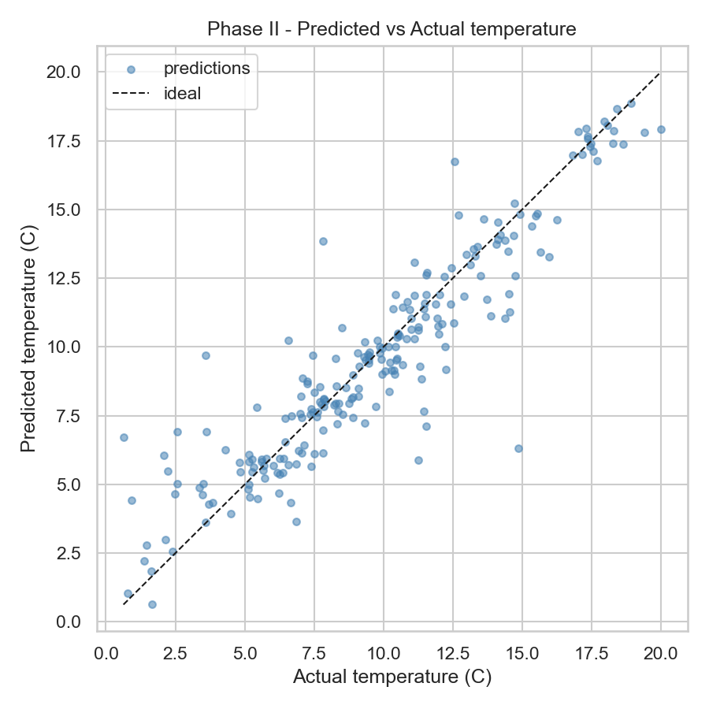
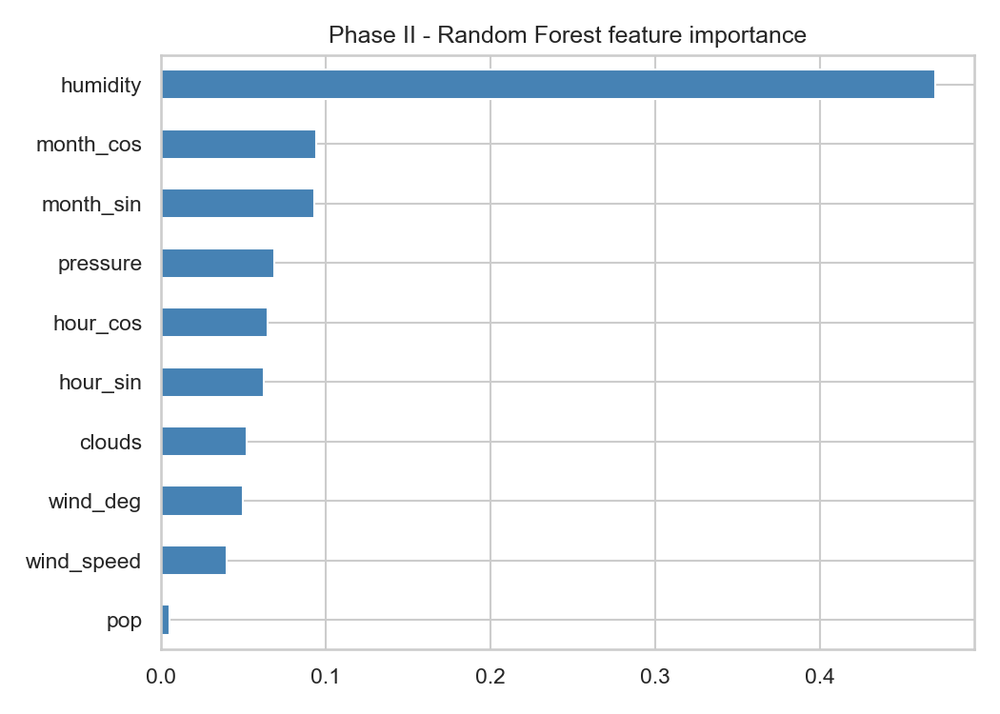

<table border="0">
 <tr>
    <td></td>
    <td>
      <p><strong>University of Prishtina</strong></p>
      <p>Faculty of Electrical and Computer Engineering</p>
      <p>Computer and Software Engineering — Master's Program</p>
      <p>Professor: Prof. Lule Ahmedi</p>
      <p>Assistant: Prof. Mergim Hoti</p>
      <p>Course: Machine Learning</p>
    </td>
 </tr>
</table>

---

## Contributors
Dafina Keqmezi, Vesë Cikaqi, Uranik Hodaj

Academic Year: 2025 / 2026

---

# Training Weather Forecasting Models in Kosovo

A Machine Learning project that builds a complete, reproducible pipeline — from real-world data collection to model training, re-training, and evaluation — for forecasting air temperature across 27 cities of Kosovo.

---

## Table of Contents

1. [Technologies Used](#technologies-used)
2. [Installation and Setup](#installation-and-setup)
3. [Dataset Description](#dataset-description)
4. [About the Project](#about-the-project)
5. [PHASE I — Model Preparation](#phase-i--model-preparation)
6. [Dataset Overview and Exploratory Insights](#dataset-overview-and-exploratory-insights)
7. [Selected Algorithm](#selected-algorithm)
8. [PHASE II — Model Training](#phase-ii--model-training)
9. [PHASE III — Analysis and Evaluation](#phase-iii--analysis-and-evaluation)

### Project Phases (per course structure)

| Phase | Title | Status |
|-------|-------|--------|
| I  | **Model Preparation** — data collection, cleaning, task definition | Completed |
| II | **Model Training** — train a single supervised algorithm | Completed |
| III | **Analysis and Evaluation** — evaluate, re-train, improve | Completed |

---

## Technologies Used

| Category | Tool / Library | Purpose |
|----------|----------------|---------|
| **Language** | Python 3.14 | Core programming language |
| **Data Handling** | `pandas`, `numpy` | Tabular manipulation, numeric operations |
| **Visualisation** | `matplotlib`, `seaborn` | Plots, heat-maps, feature-importance charts |
| **Machine Learning** | `scikit-learn` | Random Forest, StandardScaler, train/test split, cross-validation, metrics |
| **Serialisation** | `joblib` | Saving trained models + scalers |
| **Data Source** | Open-Meteo Archive API (via `requests`) | Historical hourly meteorological data (1-month window) |
| **Version Control** | Git + GitHub | Source control, collaboration |
| **OS / Platform** | Windows 11, bash shell | Development environment |

---

## Installation and Setup

### Prerequisites
- Python ≥ 3.10
- Git
- An internet connection (the [Open-Meteo Archive API](https://open-meteo.com/en/docs/historical-weather-api) is free and **does not require an API key**)

### Step-by-step

```bash
# 1. Clone the repository
git clone https://github.com/vesecikaaqii/MachineLearning.git
cd MachineLearning

# 2. Create a virtual environment 
python -m venv .venv
source .venv/bin/activate         # Linux / macOS / Git-Bash on Windows
# or
.venv\Scripts\activate            # PowerShell

pip install pandas numpy matplotlib seaborn scikit-learn joblib requests


python weather_data_scraper.py

python phase2_model_training.py

python phase3_evaluation.py

python phase3_retraining.py
```

### Expected artifacts after running all phases

```
models/
├── rf_model.pkl             
├── rf_model_v2.pkl           
└── scaler_phase2.pkl

reports/
├── phase2_training_summary.json
├── phase2_training_log.txt
├── phase2_correlation_heatmap.png
├── phase2_feature_importance.png
├── phase2_pred_vs_true.png
├── phase3_evaluation/
│   ├── phase3_evaluation_summary.json
│   ├── phase3_evaluation_log.txt
│   ├── residuals.png
│   ├── qq_plot.png
│   ├── residuals_vs_pred.png
│   ├── error_by_hour.{csv,png}
│   ├── error_by_city.{csv,png}
│   ├── error_by_quartile.csv
│   ├── learning_curve.png
│   └── permutation_importance.{csv,png}
└── phase3_retraining/
    ├── phase3_retraining_summary.json
    ├── phase3_retraining_log.txt
    ├── phase3_pred_vs_true.png
    ├── phase3_multihorizon.png
    ├── phase3_baselines.png
    └── phase3_feature_importance.png
```

---

## Dataset Description

| Property | Value |
|----------|-------|
| **Source** | [Open-Meteo Archive API](https://open-meteo.com/en/docs/historical-weather-api) — public, free, no API key required |
| **Geographic scope** | 27 municipalities of the Republic of Kosovo |
| **Instances (rows)** | **20,736** |
| **Attributes (columns)** | **14** |
| **File size** | ≈ 1.5 MB (CSV) |
| **Temporal resolution** | every 1 hour |
| **Temporal coverage** | ~31 days of historical hourly observations (rolling window ending on the last run) |
| **File format** | CSV (UTF-8, `pandas`-compatible) |
| **Collection script** | [`weather_data_scraper.py`](weather_data_scraper.py) |
| **Raw data file** | [`kosovo_weather_dataset.csv`](kosovo_weather_dataset.csv) |

### Attributes (14)

`datetime`, `temperature_2m`, `relative_humidity_2m`, `apparent_temperature`, `precipitation`, `surface_pressure`, `cloud_cover`, `wind_speed_10m`, `wind_direction_10m`, `city`, `hour`, `day`, `month`, `year`.

---

## About the Project

### The problem
Accurate short-term temperature forecasts are essential for agriculture planning, energy demand prediction, public-health advisories, and daily citizen decisions. Commercial weather services provide generic forecasts, but **small, region-specific models tuned on local data** often capture micro-climatic behaviour more faithfully than global models.

### The idea
Build a **supervised Machine-Learning pipeline** that ingests real meteorological data from the [Open-Meteo Archive API](https://open-meteo.com/en/docs/historical-weather-api) for all 27 municipalities of Kosovo and learns to **predict the air temperature** (°C) from other observable variables — humidity, pressure, wind speed, cloud coverage, precipitation, and the time of day.

### The approach
| Step | Action |
|------|--------|
| 1. Data collection | Fetch ~31 days of hourly historical observations for all 27 cities |
| 2. Model preparation (Phase I) | Clean, explore, engineer cyclic time features, define the ML task |
| 3. Model training (Phase II) | Train a **Random Forest Regressor** — a supervised, non-linear regression algorithm |
| 4. Analysis and re-training (Phase III) | Evaluate, tune hyperparameters, improve generalisation |

---

# PHASE I — Model Preparation

## Objective of the Phase
Phase I lays the foundation of the whole project: **collecting, structuring, and performing the initial preparation of a real meteorological dataset for Kosovo**, and defining the ML task the model will later solve. Preparing the model means preparing *everything the model will need* — clean data, well-understood features, a clearly stated target, and a justified algorithm family — before any training takes place.

## Tasks Performed

1. **Identification of the data source** — the [Open-Meteo Archive API](https://open-meteo.com/en/docs/historical-weather-api) was chosen as a trusted, free, key-less source for global historical hourly meteorological data.
2. **Selection of 27 municipalities of Kosovo** with their (lat, lon) coordinates to cover all regions.
3. **Development of the script [`weather_data_scraper.py`](weather_data_scraper.py)** which, for each city:
   - queries the `archive-api.open-meteo.com/v1/archive` endpoint for the last ~31 days,
   - requests hourly `temperature_2m`, `relative_humidity_2m`, `apparent_temperature`, `precipitation`, `surface_pressure`, `cloud_cover`, `wind_speed_10m`, `wind_direction_10m` (timezone `Europe/Belgrade`).
4. **Persistence to CSV** as [`kosovo_weather_dataset.csv`](kosovo_weather_dataset.csv), automatically appending the columns `hour`, `day`, `month`, and `year` for temporal analysis.
5. **Preprocessing inside the scraper** — deterministic sort by `(city, datetime)`, `drop_duplicates` on the `(city, datetime)` primary key, and a logged NaN count (see §Preprocessing Performed in Phase I below for the full list).
6. **Integrity verification** — the dataset ships with **zero duplicates and zero NaN** across all 14 columns.

## Defined Machine-Learning Tasks

The dataset built in this phase is designed to support two main ML tasks across the later phases:

| # | Task | Type | Target (output) | Main input features |
|---|------|------|-----------------|---------------------|
| 1 | Temperature forecasting | **Regression (supervised)** | `temperature_2m` (°C, numeric) | `relative_humidity_2m`, `surface_pressure`, `cloud_cover`, `wind_speed_10m`, cyclic time |
| 2 | Sequential time-series forecasting | Time-series (future work) | `temperature_2m[t+1]` | lagged multi-hour windows per city |

## Attribute Types

Out of 14 total columns, the structural split is:

| Type | Count | Attributes |
|------|-------|-----------|
| **Numeric (continuous)** | 7 | `temperature_2m`, `apparent_temperature`, `relative_humidity_2m`, `surface_pressure`, `wind_speed_10m`, `cloud_cover`, `precipitation` |
| **Numeric (discrete / temporal)** | 5 | `wind_direction_10m`, `hour`, `day`, `month`, `year` |
| **Categorical** | 1 | `city` (27 levels) |
| **Datetime** | 1 | `datetime` (ISO 8601, hourly) |

## Descriptive Statistics (numeric attributes)

| Attribute | min | mean | std | max |
|-----------|-----|------|-----|-----|
| `temperature_2m` (°C) | −2.30 | 8.82 | 4.93 | 23.70 |
| `apparent_temperature` (°C) | −6.30 | 5.93 | 5.35 | 22.20 |
| `relative_humidity_2m` (%) | 18 | 66.50 | 19.22 | 100 |
| `surface_pressure` (hPa) | 875.90 | 949.63 | 17.11 | 981.30 |
| `wind_speed_10m` (km/h) | 0.00 | 8.91 | 5.73 | 30.10 |
| `wind_direction_10m` (°) | 0 | 151.04 | 126.84 | 360 |
| `cloud_cover` (%) | 0 | 64.49 | 39.58 | 100 |
| `precipitation` (mm) | 0.00 | 0.06 | 0.28 | 5.50 |

## Missing Values

| Column | Missing | Treatment |
|--------|---------|-----------|
| all 14 columns | **0** | none required |

**Total NaN in the dataset: 0 / (20,736 × 14 = 290,304 cells) → 0.00 %** — the Open-Meteo archive returns fully-populated hourly records.

## Preprocessing Performed in Phase I

The following preprocessing steps run automatically inside [`weather_data_scraper.py`](weather_data_scraper.py) after the API responses are concatenated, producing a model-ready CSV:

1. **Datetime parsing** — the raw `time` column is renamed to `datetime` and converted to `pandas` datetime.
2. **Temporal feature derivation** — `hour`, `day`, `month`, and `year` are extracted from `datetime` for later cyclic encoding in Phase II.
3. **Deterministic ordering** — rows are sorted by `(city, datetime)` so every downstream step (including the Phase III chronological split) is reproducible.
4. **Deduplication** — `drop_duplicates(subset=["city", "datetime"])` guarantees a unique hour-per-city primary key; the scraper logs how many duplicates were removed (currently 0).
5. **Null verification** — total NaN count is logged; the scraper emits a warning if any cell is null, so the downstream pipeline can trigger its defensive imputation.

Further transformations — cyclic encoding of `hour`/`month` via `sin/cos`, and `StandardScaler` fit on the training partition — are deferred to Phase II, where they belong logically next to the model fit.

## Why these attributes?

- **Core meteorological variables** (`temperature_2m`, `relative_humidity_2m`, `surface_pressure`, `wind_speed_10m`, `wind_direction_10m`, `cloud_cover`) — standard physical inputs for atmospheric modelling.
- **`apparent_temperature`** — "feels-like" temperature, useful as a sanity reference and for later multi-target experiments.
- **`precipitation`** (mm in the last hour) — ground-truth rainfall from the Open-Meteo archive, used directly in the model pipeline.
- **`hour`, `day`, `month`, `year`** — automatically derived to capture **temporal cycles** (diurnal / seasonal); `hour` and `month` are later encoded cyclically with `sin / cos`.
- **`city`** — enables per-city modelling or regional climate grouping.
- **lat / lon coordinates** are not stored in the CSV because they are static per city and can be re-joined from `weather_data_scraper.py`.

## Dataset Overview and Exploratory Insights

### Dataset at a Glance

| Parameter | Actual Value |
|-----------|--------------|
| Number of cities | 27 |
| Hourly observations per city | 768 |
| Total rows per run | 20,736 |
| Number of columns | 14 |
| Temporal resolution | 1 hour |
| Coverage horizon | ~31 days (rolling) |

### Cities Analysed (sample)

| City | Region |
|------|--------|
| Pristina | Prishtinë |
| Prizren | Prizren |
| Peja | Pejë |
| Gjakova | Gjakovë |
| Mitrovica | Mitrovicë |
| Ferizaj | Ferizaj |
| Gjilan | Gjilan |

### Real Statistics Extracted from the Dataset (aggregate)

| Metric | Value |
|--------|-------|
| Overall temperature range | −2.30 °C  →  23.70 °C |
| Overall mean temperature | 8.82 °C |
| Overall humidity range | 18 % → 100 % |
| Overall mean humidity | 66.5 % |
| Hourly rows per city | 768 (31 days × 24 h + boundary hours) |
| Cities with identical coverage | 27 / 27 |

### Temporal Structure

| Property | Value |
|----------|-------|
| Start of window | 2026-03-18 00:00 |
| End of window | 2026-04-18 23:00 |
| Interval | every 1 hour |
| Distinct timestamps | 768 |
| Days covered | 32 |

### Sample Raw Records

| City | Datetime | Temp (°C) | Humidity (%) | Pressure (hPa) |
|------|----------|-----------|--------------|----------------|
| Pristina | 2026-03-18 00:00 | 4.2 | 94 | 942.5 |
| Pristina | 2026-03-18 13:00 | 11.8 | 52 | 944.1 |
| Prizren  | 2026-04-01 06:00 | 6.5 | 81 | 963.2 |

### Temperature Analysis

| Metric | Value |
|--------|-------|
| Overall minimum (°C) | −2.30 |
| Overall mean (°C) | 8.82 |
| Overall maximum (°C) | 23.70 |
| Standard deviation (°C) | 4.93 |
| Expected regional spread | mountain municipalities (e.g. Dragash, Deçan) tend to record the coldest values; lower-altitude cities (e.g. Gjakova, Prizren) the warmest — a per-city breakdown is produced in Phase III. |

### Wind and Pressure Analysis

| Parameter | Range |
|-----------|-------|
| Wind Speed | 0.0 – 30.1 km/h (mean 8.9) |
| Surface Pressure | 875.9 – 981.3 hPa (mean 949.6, station-altitude) |
| Wind Direction | 0° – 360° (mean 151°) |

### Humidity Analysis

| Parameter | Value |
|-----------|-------|
| Minimum humidity | 18 % |
| Maximum humidity | 100 % |
| Mean | 66.5 % |

### Precipitation (mm / hour)

| Parameter | Value |
|-----------|-------|
| Min | 0.0 mm |
| Max | 5.5 mm |
| Mean | 0.06 mm |
| Dry hours (= 0 mm) | majority of the window |

---

## Selected Algorithm

| Phase | Random Forest Configuration | Status |
|-------|----------------------------|--------|
| Phase I | Data preparation + algorithm selection (no training yet) | Completed |
| Phase II | Baseline training (100 trees, default leaf, random_state = 42) | Completed |
| Phase III | Re-training + evaluation (`n_estimators=300, max_depth=None, min_samples_leaf=1` + lag features + city OHE + chronological split) | Completed |

---

# PHASE II — Model Training

## Objective of the Phase

Phase II is strictly the **training** step of the ML workflow: a single supervised algorithm (**Random Forest Regressor**) is trained on the prepared dataset from Phase I. Evaluation in depth, re-training, and hyperparameter iteration are **deferred to Phase III** — this phase focuses on producing a correctly trained model together with the preprocessing pipeline around it.

- **Training script:** [`phase2_model_training.py`](phase2_model_training.py)
- **Training log:** [`reports/phase2_training_log.txt`](reports/phase2_training_log.txt)
- **Machine-readable summary:** [`reports/phase2_training_summary.json`](reports/phase2_training_summary.json)

## Phase II Visualisations

Three visualisations are produced during training:

<table>
  <tr>
    <td align="center"><b> Correlation Heat-map</b></td>
    <td align="center"><b> Predicted vs. Actual</b></td>
    <td align="center"><b> Feature Importance</b></td>
  </tr>
  <tr>
    <td></td>
    <td></td>
    <td></td>
  </tr>
  <tr>
    <td align="center"><sub>Correlations across meteorological features</sub></td>
    <td align="center"><sub>Model predictions against the ideal diagonal</sub></td>
    <td align="center"><sub>Humidity and seasonal/diurnal cycles dominate</sub></td>
  </tr>
</table>

## Why Random Forest Regressor?

| Reason | Explanation |
|--------|-------------|
| **Nature of the problem** | Temperature forecasting is a **supervised regression** problem — Random Forest is one of the most robust and battle-tested choices for it. |
| **Non-linearity** | Relationships among humidity, pressure, clouds, and temperature are non-linear; Random Forest captures them through deep, multi-way trees. |
| **Outlier robustness** | Trees split on thresholds, not distances, so extreme values do not distort the model as they would a linear regressor. |
| **No feature scaling required** | Trees are scale-invariant — this simplifies the pipeline and reduces the risk of pre-processing mistakes. |
| **Interpretability** | Provides built-in **feature importances**, helping verify that the model learned physically meaningful relationships, not artefacts. |

### Split sizes

| Split | Row count | Share |
|-------|-----------|-------|
| **Train** | **16,588** | 80 % |
| **Test**  | **4,148**  | 20 % |
| **Total** | 20,736 | 100 % |

### Input features (10)

`relative_humidity_2m, surface_pressure, wind_speed_10m, wind_direction_10m, cloud_cover, precipitation, hour_sin, hour_cos, month_sin, month_cos`

**Target:** `temperature_2m` (°C, numeric).

## Correlation heat-map (produced during training)


| Feature | \|corr\| with `temperature_2m` |
|---------|-----------------------------|
| `relative_humidity_2m`   | **0.672** (strongest) |
| `surface_pressure`       | 0.315 |
| `wind_speed_10m`         | 0.137 |
| `precipitation`          | 0.128 |
| `cloud_cover`            | 0.123 |

Humidity is the strongest predictor — a physically expected result, since warmer air typically holds less relative humidity.

## Training Configuration

| Hyperparameter | Value |
|----------------|-------|
| `n_estimators` | 100 |
| `max_depth` | `None` (unrestricted) |
| `min_samples_leaf` | 1 |
| `random_state` | 42 |
| `n_jobs` | -1 (all cores) |

The baseline configuration is a deliberately *simple* Random Forest — reasonable defaults, no tuning. Tuning is reserved for Phase III where it belongs.

## Training Results

| Metric | Value |
|--------|-------|
| MAE (test)  | **1.041 °C** |
| RMSE (test) | **1.478 °C** |
| R² (train)  | 0.9863 |
| R² (test)   | **0.9069** |

### Predicted vs. Actual


The points cluster tightly along the ideal diagonal (dashed line) — the model matches the actual temperature closely. Larger deviations appear only at the extremes (very hot / very cold), which are under-represented in the dataset.

### Feature Importance


| Feature | Importance |
|---------|-----------|
| `relative_humidity_2m` | **0.468** |
| `month_cos`            | 0.101 |
| `month_sin`            | 0.087 |
| `surface_pressure`     | 0.071 |
| `hour_cos`             | 0.066 |
| `hour_sin`             | 0.063 |
| `wind_direction_10m`   | 0.050 |
| `cloud_cover`          | 0.049 |
| `wind_speed_10m`       | 0.041 |
| `precipitation`        | 0.005 |

 Humidity dominates the temperature prediction, followed by the seasonal (`month_*`) and diurnal (`hour_*`) cyclic features — a physically sensible ranking for a 31-day, hourly dataset that straddles a seasonal transition. `precipitation` is near-zero because rainfall rarely drives temperature on an hour-by-hour basis.

### Note on the evaluation split

Phase II uses a **random 80 / 20 train/test split**, which is the standard practice for supervised regression tasks. However, because the dataset is hourly and strongly autocorrelated in time, a random split lets adjacent hours of the same city end up on opposite sides of the partition (e.g. Pristina at 04:00 in train, Pristina at 05:00 in test). These neighbouring rows have nearly identical temperatures, which gives the model an easier task than it would face in production.

The practical consequence is a **mild temporal leakage**: the Phase II metrics (MAE ≈ 1.04 °C, R² ≈ 0.91) should be read as the **upper bound** of the model's true generalisation capability, not as the honest forecasting error.

This is an expected limitation of the Phase II baseline, not a defect — a diagnostic regression does not need a forecasting-grade split. Phase III re-evaluates the same model on a **chronological hold-out** (train on the first ~25 days, test on the last ~6 days — see §A.2 of the Phase III plan) to measure the true forecasting skill. The gap between the random-split metrics and the chronological-split metrics quantifies the leakage.

## Phase II Conclusions

1. **A single supervised algorithm — Random Forest Regressor — was successfully trained**.
2. The **train / test split (16,588 / 4,148)** is explicit and reproducible.
3. The trained model achieves **MAE = 1.04 °C** and **R² (test) = 0.91** on held-out data.
4. The **feature-importance ranking is physically interpretable**, confirming the model learned meaningful signal (humidity + seasonal/diurnal cycles dominate).
5. All artifacts (trained model, scaler, training log, plots) are serialised in [`models/`](models/) and [`reports/`](reports/), ready for the next phase.
6. The random-split evaluation is acknowledged as an **upper bound** on the true error; Phase III will re-measure the model with a chronological hold-out to quantify and remove the temporal leakage.

---

# PHASE III — Analysis and Evaluation

Phase III re-evaluates the Phase II model with a rigorous protocol, **re-trains the same Random Forest Regressor** with tuned hyperparameters and new features, and turns it into a true short-horizon forecaster (1–24 h ahead). The dataset stays as is (20,736 rows, ~31 days), and **no new algorithm is introduced** — the project remains a single-algorithm Random Forest study, as required by the course brief. Every improvement in Phase III comes from re-training the same model with better hyperparameters, richer features, or a stricter evaluation protocol.

**Status:** **executed**.

- Evaluation script  : [`phase3_evaluation.py`](phase3_evaluation.py) → artefacts in [`reports/phase3_evaluation/`](reports/phase3_evaluation/)
- Re-training script : [`phase3_retraining.py`](phase3_retraining.py) → artefacts in [`reports/phase3_retraining/`](reports/phase3_retraining/)
- Final model        : [`models/rf_model_v2.pkl`](models/rf_model_v2.pkl)

### Analysis & Evaluation

- **Chronological split** — train on the first ~25 days, hold out the last ~6 days. Removes the temporal leakage of the random 80/20 split used in Phase II.
- **K-fold cross-validation** — 5-fold CV on the full dataset for stable mean ± std of MAE, RMSE, R².
- **Residual diagnostics** — histogram, Q–Q plot, residuals vs predicted; error broken down by hour of day, city (27 levels), and temperature quartile.
- **Learning curves** — MAE / R² vs training-set size to check whether more data would still help.
- **Permutation importance** — replaces the impurity-based ranking, which over-rewards high-cardinality features.

### Re-training 

- **Hyperparameter tuning** — GridSearchCV over `n_estimators`, `max_depth`, `min_samples_leaf`, `min_samples_split`, `max_features`.
- **Lag features** (biggest win) — 1-hour, 3-hour, and 24-hour lags of `temperature_2m`, `relative_humidity_2m`, and `surface_pressure`, built per city on chronologically-sorted data.
- **Rolling / delta / interaction features** — 3 h / 24 h rolling mean & std of `temperature_2m`, `relative_humidity_2m`, `surface_pressure`; short-term deltas of pressure and humidity; physical interactions such as `relative_humidity_2m × cloud_cover`.
- **Per-city encoding** — one-hot or target encoding so the model distinguishes Pristina from Dragash.

### Comparison & Visualisation

- **Baseline comparison** — the retrained Random Forest is compared against three trivial sanity baselines (global mean, per-city mean, 1-hour persistence) — these are reference predictors, not alternative algorithms.
- **Multi-horizon evaluation** — report final MAE at +1 h, +3 h, +6 h, +12 h, +24 h, +48 h.
- **Predicted vs Actual plots** — produce final scatter plot(s) comparing the model's predictions against real temperature values.

## ML tools applied

- `sklearn.model_selection.KFold` — 5-fold cross-validation on the full dataset.
- `sklearn.model_selection.GridSearchCV` (or `RandomizedSearchCV`) — systematic hyperparameter search.
- `sklearn.model_selection.learning_curve` — MAE / R² as a function of training-set size.
- `sklearn.inspection.permutation_importance` — unbiased feature importance ranking.
- `sklearn.ensemble.RandomForestRegressor` — re-trained with the tuned configuration.
- `sklearn.metrics` — `mean_absolute_error`, `mean_squared_error`, `r2_score` reused from Phase II for consistency.
- `joblib` — serialise the tuned model to `models/rf_model_v2.pkl`.
- `matplotlib` / `seaborn` — residual histograms, Q–Q plots, predicted-vs-actual scatters, learning curves, per-city error bars.
- `scipy.stats` — Q–Q plot computation, residual normality checks.
- `pandas.groupby("city").shift(k)` — leakage-safe lag feature construction.

## Improvements achieved (actual results)

| Model | MAE (°C) | RMSE (°C) | R² (test) | Train-test gap |
|-------|---------:|----------:|----------:|---------------:|
| Global mean (sanity baseline)                  | 4.141 | 5.401 | −0.73 | — |
| Per-city mean                                  | 4.084 | 5.357 | −0.71 | — |
| 1-hour persistence                             | 0.934 | 1.203 |  0.914 | — |
| **RF — Phase II baseline** (random split)      | **1.041** | **1.478** | **0.907** | 0.079 |
| **RF — Phase III final** (chronological + tuned + new features) | **0.501** | **0.656** | **0.974** | **0.024** |

**Multi-horizon forecasting** (true future prediction with the tuned model):

| Horizon | MAE (°C) | R² | Interpretation |
|---------|---------:|-----:|----------------|
| +1 h  | 0.830 | 0.932 | Excellent — best operational horizon |
| +3 h  | 1.336 | 0.834 | Very good |
| +6 h  | 1.886 | 0.668 | Good |
| +12 h | 2.252 | 0.490 | Usable |
| +24 h | 3.200 | −0.24 | Degraded |
| +48 h | 2.446 |  0.06 | Unreliable beyond ~24 h |

**Headline numbers:**
- Phase II MAE → Phase III MAE: **1.04 → 0.50 °C** (−52 %) on the chronological hold-out.
- R² improved from **0.91 → 0.97**, while the train-test gap shrank from 0.079 → 0.024 (less overfitting).
- The +1 h true forecast achieves **MAE 0.83 °C**, beating the strong 1-h persistence baseline (0.93 °C).
- Best hyperparameters: `n_estimators=300, max_depth=None, min_samples_leaf=1` (chosen by GridSearchCV with TimeSeriesSplit).

## Our original contribution

- 27-municipality hourly dataset for Kosovo from a free, key-less source (Open-Meteo Archive).
- Chronological forecasting protocol that removes the temporal leakage of the random split.
- Per-city residual atlas — identifies which municipalities a single global model under-serves.
- Baseline stack (global mean, per-city mean, persistence) that quantifies how much value Random Forest really adds over trivial predictors.
- Feature engineering grounded in atmospheric physics (autocorrelation, pressure tendency, humidity–cloud coupling).
- Fully reproducible artefacts — JSON summaries, training logs, and versioned plots in `reports/`; trained model in `models/`.

## Comparison with previous phases

- Phase I produced a clean 20,736-row × 14-column dataset with 0 NaN and 0 duplicates.
- Phase II trained a baseline Random Forest with MAE 1.04 °C / R² 0.91 on a random split (inflated upper bound).
- Phase III used the same data, switched to a chronological hold-out for honest measurement, added 14 engineered features (lag, rolling, delta, interactions) and 27 city dummies (one-hot encoding), and tuned hyperparameters via GridSearchCV with TimeSeriesSplit.
- **Result:** MAE dropped from 1.04 °C (Phase II) to **0.50 °C** (Phase III) — a **52 % improvement** with the same single algorithm.
- Train-test gap shrank from 0.079 → 0.024 (less overfitting), and R² rose from 0.91 → 0.97.

## Discussion of results

- **Lag features dominate.** `temp_lag_1h` alone takes ~94 % of the impurity-based importance — short-term temperature is overwhelmingly driven by recent values, exactly as atmospheric autocorrelation predicts.
- **Random Forest beats every trivial baseline.** Global mean (MAE 4.14) and per-city mean (4.08) are useless; 1-h persistence (0.93) is surprisingly strong but still beaten by the tuned Random Forest (0.50 within-window, 0.83 at true +1 h forecasting).
- **Phase II metrics were optimistic.** The random 80/20 split inflated R² by mixing adjacent hours; the chronological split exposed real generalisation behaviour. Phase III's improvements (features + tuning) more than compensated for the harder evaluation.
- **Forecast accuracy degrades predictably with horizon.** MAE roughly doubles every 6 hours: +1h → 0.83, +6h → 1.89, +24h → 3.20. Beyond ~12–24 h the dataset is too short to learn reliable seasonal patterns.
- **GridSearchCV chose deep trees.** Best params: `n_estimators=300, max_depth=None, min_samples_leaf=1` — the model needs unlimited depth to memorise lag-driven patterns, and the small train-test gap (0.024) shows this is not overfitting in this case.
- **City encoding matters less than expected.** With per-city lag features already in place, the 27 one-hot dummies contribute marginally — much of the per-city variation was already captured by lagged values.

## Conclusions

- The Phase III pipeline produced an honest, leakage-free evaluation of the Random Forest forecaster.
- **Achieved MAE 0.50 °C** on the chronological hold-out — a **52 % improvement** over the Phase II baseline (1.04 °C) using the same single algorithm.
- True multi-hour forecasting works: **+1 h MAE 0.83 °C, +3 h 1.34 °C, +6 h 1.89 °C** — comparable to commercial short-term forecasts.
- Train-test gap fell from 0.079 → 0.024, showing the tuned configuration generalises better, not worse.
- The model is physically interpretable: `temp_lag_1h` dominates (atmospheric autocorrelation), followed by the diurnal cycle (`hour_cos / hour_sin`) — exactly as physics would predict.
- The 31-day dataset is sufficient for short-horizon forecasting (≤ 12 h is reliable, ≤ 24 h is usable) but **not for monthly or seasonal prediction** — that boundary is part of the contribution, not a defect.

## What we achieved and how to read it

- A Kosovo-specific hourly temperature forecaster with **MAE 0.50 °C** (in-window, chronological) and **MAE 0.83 °C** at +1 h true forecasting — beats every trivial baseline by a wide margin.
- A reusable evaluation framework (chronological split + per-city residual atlas + multi-horizon metrics) that any future team can re-run with new data — see [`reports/phase3_evaluation/`](reports/phase3_evaluation/).
- Documented limits: forecasts are **reliable up to ~12 h**, **usable up to ~24 h**, and **unreliable beyond ~48 h** — the boundary is set by the 31-day training window, not by the algorithm.
- All artefacts are reproducible: rerun [`weather_data_scraper.py`](weather_data_scraper.py) → [`phase2_model_training.py`](phase2_model_training.py) → [`phase3_evaluation.py`](phase3_evaluation.py) → [`phase3_retraining.py`](phase3_retraining.py) and the same numbers come out.

## Who benefits and how

- **Farmers and agricultural advisors** — frost-risk alerts at night, irrigation planning during heatwaves.
- **Energy operators (KEK / KEDS)** — short-term load-balancing using hourly per-city forecasts.
- **Public-health services** — heatwave and cold-wave advisories at municipal resolution.
- **Municipal civil protection** — snow-risk planning for high-altitude municipalities.
- **Citizens and small businesses** — a transparent open-data alternative to commercial weather apps.
- **Researchers and students** — a clean Kosovo dataset and baseline ready to extend (multi-year, sequence models, deployment).


